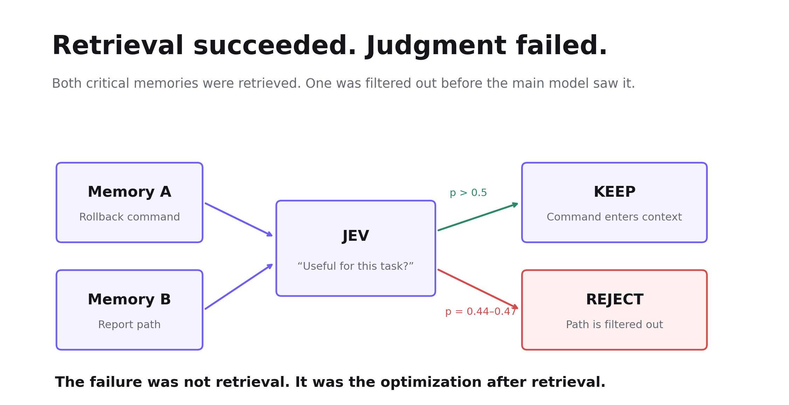
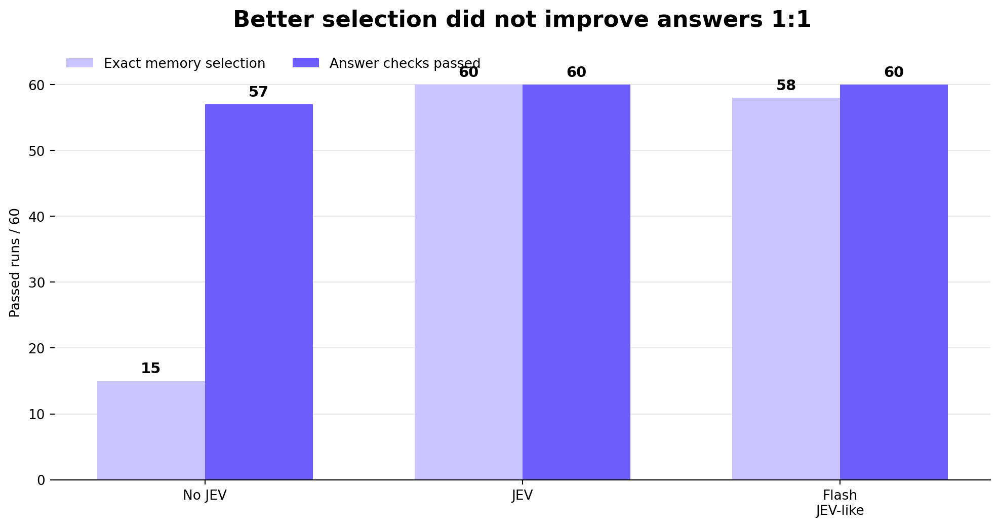
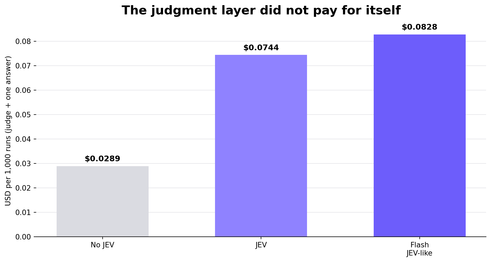
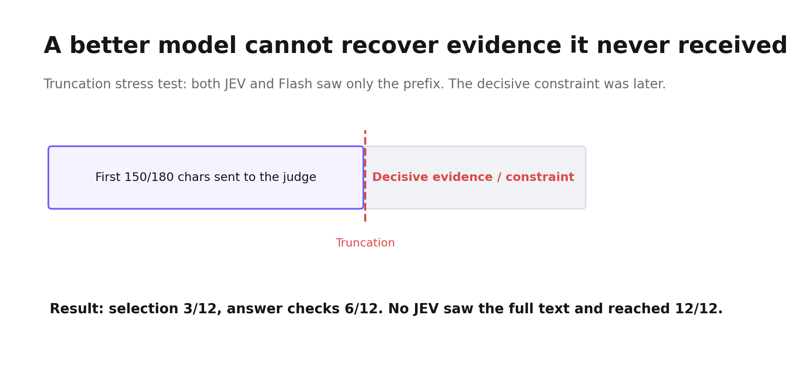

# The Agent Found the Right Answer. JEV Rejected It.

Does adding a judgment layer reduce noise, or create new errors?

The user asked for two things: what command to use for the rollback drill, and where the report is stored.

The two answers happened to sit in two different memories. The memory module did retrieve both. The problem happened at the next step: the helper model kept the command, but decided the report path was “not useful enough,” and blocked it from the main model’s context.

> This was not a retrieval miss. It was found, and then “optimized” away.

Adding a cheap model in front of an agent, to first decide which information is worth keeping, sounds very reasonable: cleaner context, less noise for the main model, maybe even lower cost. But one extra layer of judgment is also one extra place that can be wrong. Is the context you save enough to pay for this judgment?

We ran a small experiment with Jev. The setting was Agent Memory: candidate memories had already been retrieved, and we only compared “which ones should enter the current context.” All three groups used the same DeepSeek Flash model to generate the final answer. We only replaced the judgment method in front: No JEV, JEV, and JEV-like, where Flash implemented the same judgment contract.

## 1. What Jev does is not answering. It is a small judgment.

A normal LLM is usually responsible for generating an answer, a plan, or code. Jev is more like a structured judge. This article only uses its Noul: given the current state and a yes/no question, it returns the probability that the answer is “yes.” The program then uses that result to decide whether to put a given memory into context.

We were not asking whether “Jev writes better.” We were asking something else: some Agent decisions are actually very small — is this memory relevant? Is this new evidence, or a repeated failure? Which required piece of information is still missing? — and whether it is worth pulling this kind of semantic judgment out of the main model and handing it to a narrower judgment layer.

The boundary is also important: the model is responsible for judgment, and the code is responsible for action. A judgment should change later behavior, and after the action you should still be able to verify the effect. Otherwise it is just one more model call.

| Group | Helper selection method | Final answering model |
| --- | --- | --- |
| No JEV | Existing lexical relevance / no-revoke fallback | DeepSeek Flash |
| JEV | Native jev-1.13.0 judgment | DeepSeek Flash |
| Flash JEV-like | Flash executes the same business questions and judgment contract | DeepSeek Flash |

## 2. The first version already failed: the correct evidence was already at the door.

The most typical failure is the rollback case at the beginning. The user needed “command + report path,” and both pieces of evidence were in the candidates. The old question only asked: “Is this memory useful for the current task?”

JEV passed the command, but only gave the report path 0.44–0.47. Our threshold was a strict p > 0.5, so the report path was filtered out, and the material the main model received was incomplete by construction. Similar misses also appeared repeatedly in the 96-candidate and 256-candidate tests.

> Retrieval succeeded. Judgment failed.

The problem may not only be in the model’s ability. It may also be that the question of “useful” itself is too vague. If a memory answers only part of the task, does that still count as useful? A person knows that the report path certainly counts, but the model may not understand the boundary that way.

## 3. Change the question, and the missing facts come back.

So we changed the question to: does this memory contribute a fact or an applicable constraint required by the current request?

The change looks small, but it made one thing explicit: a Memory does not need to answer the whole question. Providing only the report path still counts as a contribution; only mentioning the same service, but belonging to the wrong environment, still does not count.

| Dataset / backend | Selection: before → after | Answer: before → after |
| --- | --- | --- |
| Regular 20 cases / JEV | 57/60 → 60/60 | 60/60 → 60/60 |
| Regular 20 cases / Flash | 60/60 → 58/60 | 60/60 → 60/60 |
| Scale 8 cases / JEV | 15/24 → 24/24 | 15/24 → 24/24 |
| Scale 8 cases / Flash | 19/24 → 24/24 | 21/24 → 24/24 |
| New 8 cases / JEV | 21/24 → 24/24 | 24/24 → 24/24 |
| New 8 cases / Flash | 22/24 → 22/24 | 24/24 → 24/24 |

JEV’s recall on the scale set rose from 81.25% to 100%, and precision was still 100%. The probability for the report path among 6 candidates rose to 0.82–0.83, among 96 candidates to 0.78–0.80, and the HTTP path among 256 candidates to 0.84–0.86. The key facts came back.

But after the problem was fixed, the bill also changed: at 256 candidates, JEV’s average input rose from 18,347 tokens to 36,299 tokens, and helper cost rose from about $0.7706 per thousand calls to $1.5246, almost doubling.

> The problem was fixed. But we paid for this fix.

## 4. More accurate judgment does not mean the answers get better in the same proportion.

The final version has 20 regular cases, with three repeats per group. The result is very intuitive: JEV’s Memory selection is clearly more accurate, but the main model itself can also cover quite a few errors.

| Approach | Full selection / revocation match | Answer field checks passed | Helper judgment P50 / P95 | Judgment + answer P50 / P95 |
| --- | --- | --- | --- | --- |
| No JEV | 15/60 | 57/60 | 0 / 0 ms | 649 / 914 ms |
| JEV | 60/60 | 60/60 | 369 / 819 ms | 1,087 / 1,494 ms |
| Flash JEV-like | 58/60 | 60/60 | 682 / 895 ms | 1,302 / 1,743 ms |

Looking only at the 12 relevance cases, JEV’s precision / recall is 100% / 100%, Flash is 93.1% / 100%, and No JEV is 20% / 88.9%. In a cross-language scenario, the lexical method missed a command stored in Chinese, and both models recovered it.

But Flash also had a false injection: the current task temporarily required English, and it still selected the preference of “use Chinese in ordinary cases.” The final answer was not wrong, because the main model followed the current instruction. A correct answer does not mean the Memory was selected correctly.

## 5. From 6 items to 256: the context got cleaner. Then what?

We also scaled the number of candidates from 6 to 24, 96, and 256. Under the final policy, both JEV and Flash could stably pick out the two required memories, and selection precision / recall was 100% / 100% in every case.

| Candidates | JEV precision / recall | Flash precision / recall | Answers passed: No JEV / JEV / Flash |
| --- | --- | --- | --- |
| 6 | 100% / 100% | 100% / 100% | 6/6 · 6/6 · 6/6 |
| 24 | 100% / 100% | 100% / 100% | 6/6 · 6/6 · 6/6 |
| 96 | 100% / 100% | 100% / 100% | 6/6 · 6/6 · 6/6 |
| 256 | 100% / 100% | 100% / 100% | 6/6 · 6/6 · 6/6 |

The issue is this: although No JEV kept almost all candidates in this dataset, and precision fell with scale to 0.78%, the final answers were still 24/24. The main model found the facts itself from the long context.

> “How much context I deleted” is not the score. After the deletion, how the task was done — that is.

## 6. A “cheap model” does not necessarily make the system cheaper.

If you only look at the non-cached input unit price, JEV is cheap. But an Agent’s bill cannot only look at the model price list. You also have to look at cache, input length, extra calls, and what it actually saved.

On the regular set, estimated per thousand “helper judgment + one answer”: No JEV is $0.0289, JEV is $0.0744, and Flash JEV-like is $0.0828. Neither helper judgment earned back its own cost by reducing main-model input.

What is more counterintuitive is cache. At 256 candidates, Flash input cache hits were about 99.4%, and measured helper judgment was about $0.1289 per thousand calls; JEV was $1.5246 per thousand calls. If you assume Flash misses cache completely, the result flips again.

> A lower model unit price is not the same as a cheaper end-to-end Agent pipeline.

## 7. The ugliest failure: the model never saw the evidence at all.

In the four truncation-stress cases, both models selected correctly only 3/12 times, and answer checks were both 6/12; No JEV’s answers were 12/12 instead.

The reason is simple: relevance judgment sees at most the first 200 characters of the user message and the first 150 characters of each Memory; revocation judgment is 300/180 characters. If the key task, the command, or “the old rule has already been revoked” falls in the second half, the judgment model has no chance to see it at all.

This is information loss caused by the input policy. Switching to a stronger model still cannot recover evidence that was never sent to it.

## 8. After finishing this round of experiments, how would we use a judgment layer?

This round of experiments does not prove that “an Agent should add JEV.” It is more like making the conditions for using a judgment layer explicit.

JEV did demonstrate value: it understands semantics better than a simple lexical method, and it can recover key Memories across languages and after paraphrasing; once the question is defined clearly, selection quality is also very high.

But it also brings new failure modes: correct evidence that has already been retrieved may be blocked by a second layer of judgment; input truncation can blind all judgment models together; a longer judgment specification increases tokens; and cache may reverse the cost ranking completely.

> If an Agent has one more model that can judge, it also has one more place that may be wrong.

So if we were to add a judgment layer to an Agent now, we would first ask three things: what happens if it judges wrongly? Does this judgment really change later actions? After the change, can we verify that the task actually got better?

If those three things cannot be answered clearly, what you added is not intelligence. It is just one more model call.

What is more worth testing in the next round is a complete Agent task: can the judgment layer make it run fewer rounds, repeat fewer tool calls, and reduce error recovery? At that time we should record together the task success rate, false stops and missed work, model and tool call counts, total time, and total cost.

Back to that report path at the beginning: a good judgment layer should first know that it is worth keeping. As for whether adding this extra layer is worth it, in the end it still depends on whether the Agent, doing the same job, is actually better, faster, or cheaper.

## Reproduction and sources

The experiment code is planned to be merged with a PR into the Astra repository under the MatrixOne project, in the directory expriment/jev-memory/. The test date is 2026-09-20. Relative evidence links in the source draft will be bound to the final commit after the PR is merged.

Astra repository: [github.com/matrixorigin/astra](https://github.com/matrixorigin/astra)

TypeSafe / Jev: [Introduction](https://docs.typesafe.ai/introduction) · [Noul](https://docs.typesafe.ai/primitives/noul) · [JEV 1.13 limitations](https://docs.typesafe.ai/model-jaggedness/jev-1.13)

Pricing references: [JEV models and pricing](https://docs.typesafe.ai/models) · [DeepSeek pricing](https://api-docs.deepseek.com/quick_start/pricing/)

