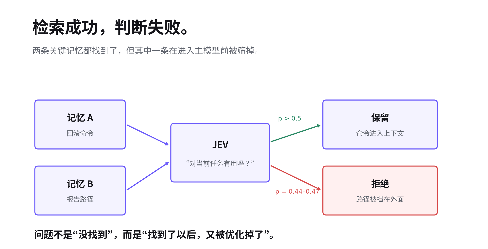
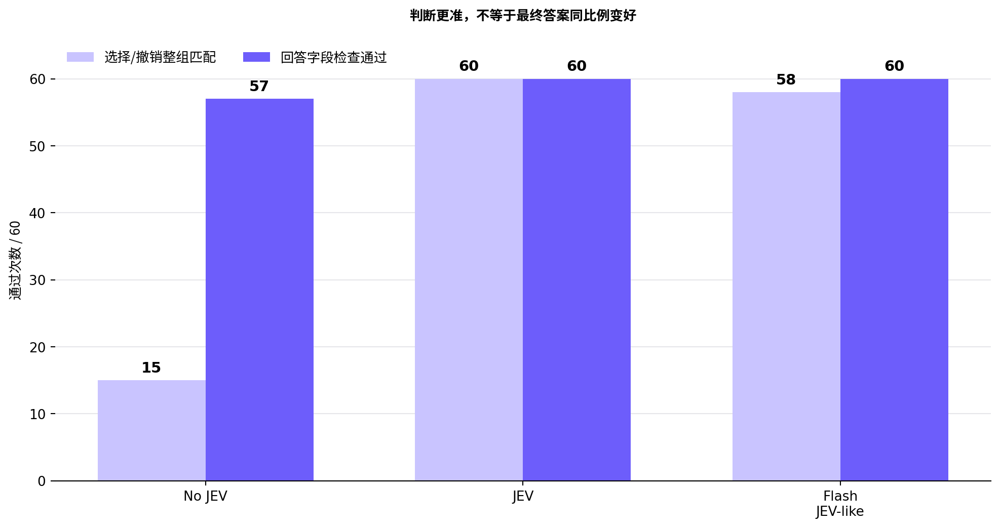
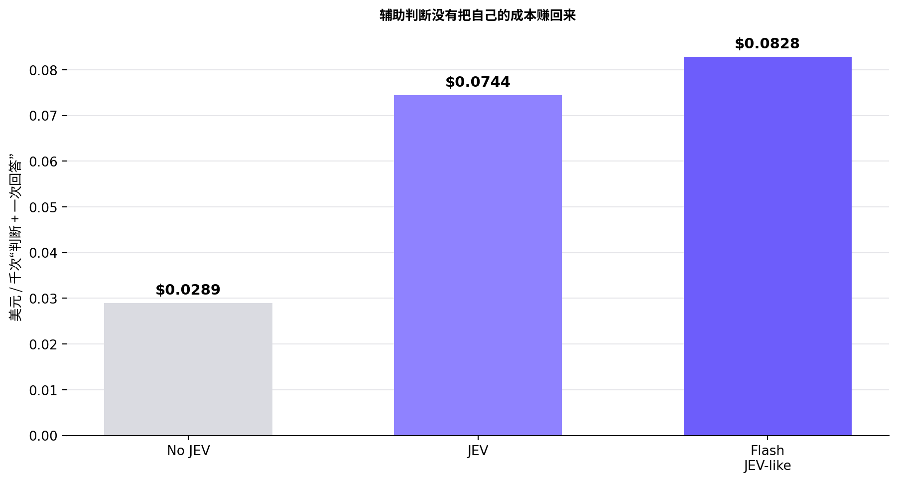
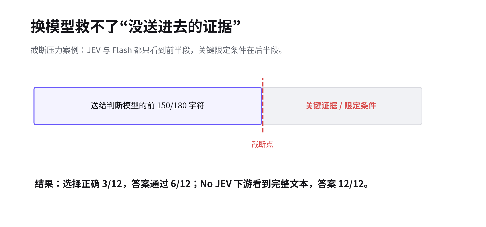

# Agent 找到了正确答案，JEV 却把它否了

多加一层判断，究竟是在减少噪声，还是制造新的错误？

用户问了两个东西：回滚演练用什么命令，报告存在哪里。

两条记忆里，恰好各有一个答案。Memory 模块也确实把两条都找到了。问题发生在下一步：辅助模型保留了命令，却认为报告路径“不够有用”，把它挡在了主模型上下文之外。

> 这不是检索没找到，而是找到了以后，又被“优化”掉了。

给 Agent 加一个便宜模型，先判断哪些信息值得留下，听起来很合理：上下文更干净，主模型少看噪声，甚至可能更省钱。但多一层判断，也就多了一个会犯错的地方。省下来的上下文，够不够支付这次判断？

我们拿 Jev 做了一个小实验。场景选在 Agent Memory：候选记忆已经取回，只比较“哪些应该进入当前上下文”。三组使用同一个 DeepSeek Flash 生成最终答案，只替换前面的判断方式：No JEV、JEV，以及用 Flash 实现同样判断契约的 JEV-like。

## 1. Jev 做的不是回答，而是一个小判断

普通 LLM 通常负责生成回答、计划或代码。Jev 更像一个结构化判断器。本文只用了它的 Noul：给当前状态和一个是非问题，返回“是”的概率。程序再根据结果决定是否把某条记忆放进上下文。

我们关心的不是“Jev 会不会写得更好”，而是另一件事：一些 Agent 决策其实很小——这条记忆相关吗？这是新证据还是重复失败？还缺哪项必要信息？——是否值得把这种语义判断从主模型里拆出来，交给一个更窄的判断层。

边界也很重要：模型负责判断，代码负责动作。判断应该改变后续行为，而且动作之后还要能验证效果。否则它只是多了一次模型调用。

| 组别 | 辅助选择方式 | 最终回答模型 |
| --- | --- | --- |
| No JEV | 现有词面相关性 / 不撤销回退 | DeepSeek Flash |
| JEV | 原生 jev-1.13.0 判断 | DeepSeek Flash |
| Flash JEV-like | Flash 执行相同业务问题与判断契约 | DeepSeek Flash |

## 2. 第一版就翻车：正确证据已经到了门口

最典型的失败，就是开头的回滚案例。用户需要“命令 + 报告路径”，两条证据都在候选里。旧问法只是问：“这条记忆对当前任务有用吗？”

JEV 给命令通过了，却只给报告路径 0.44–0.47。我们的阈值是严格的 p > 0.5，于是报告路径被筛掉，主模型拿到的材料天然不完整。类似漏选在 96 条和 256 条候选测试里也重复出现。

> 检索成功了，判断却失败了。

问题可能不只在模型能力，也在“有用”这个问题本身太含糊。一条记忆只回答任务的一部分，到底算不算有用？人知道报告路径当然算，但模型未必按这个边界理解。

## 3. 换一个问法，漏掉的事实回来了

于是我们把问题改成：这条记忆是否贡献了当前请求所需的一个事实或适用约束？

这个变化看起来不大，但明确了一件事：一条 Memory 不需要回答整个问题。只提供报告路径，也算贡献；只提到同一个服务、但属于错误环境，仍然不算。

| 数据集 / 后端 | 选择：优化前 → 后 | 回答：优化前 → 后 |
| --- | --- | --- |
| 常规 20 例 / JEV | 57/60 → 60/60 | 60/60 → 60/60 |
| 常规 20 例 / Flash | 60/60 → 58/60 | 60/60 → 60/60 |
| 规模 8 例 / JEV | 15/24 → 24/24 | 15/24 → 24/24 |
| 规模 8 例 / Flash | 19/24 → 24/24 | 21/24 → 24/24 |
| 新增 8 例 / JEV | 21/24 → 24/24 | 24/24 → 24/24 |
| 新增 8 例 / Flash | 22/24 → 22/24 | 24/24 → 24/24 |

JEV 在规模集的召回率从 81.25% 升到 100%，精确率仍是 100%。6 候选中的报告路径概率升到 0.82–0.83，96 候选升到 0.78–0.80，256 候选里的 HTTP 路径升到 0.84–0.86。关键事实回来了。

但问题修好以后，账单也变了：256 条候选时，JEV 平均输入从 18,347 token 增到 36,299 token，辅助费用从每千次约 $0.7706 增到 $1.5246，接近翻倍。

> 问题修好了。但我们为这个修复付了钱。

## 4. 判断更准，不等于答案同比例变好

最终版的 20 个常规案例，每组重复三次。结果很直观：JEV 的 Memory 选择明显更准，但主模型本身也能兜住不少错误。

| 方案 | 选择/撤销整组匹配 | 回答字段检查通过 | 辅助判断 P50 / P95 | 判断＋回答 P50 / P95 |
| --- | --- | --- | --- | --- |
| No JEV | 15/60 | 57/60 | 0 / 0 ms | 649 / 914 ms |
| JEV | 60/60 | 60/60 | 369 / 819 ms | 1,087 / 1,494 ms |
| Flash JEV-like | 58/60 | 60/60 | 682 / 895 ms | 1,302 / 1,743 ms |

只看 12 个相关性案例，JEV 的精确率 / 召回率是 100% / 100%，Flash 是 93.1% / 100%，No JEV 是 20% / 88.9%。跨语言场景里，词面方法漏掉了中文保存的命令，两个模型都把它找了回来。

但 Flash 也出现过误注入：当前任务临时要求英文，它仍选中了“平时用中文”的偏好。最终答案没错，是因为主模型遵循了当前指令。答案答对了，不代表 Memory 选对了。

## 5. 从 6 条到 256 条：上下文干净了，然后呢？

我们还把候选规模从 6 条拉到 24、96、256 条。最终策略下，JEV 和 Flash 都能稳定挑出两条必要记忆，选择精确率 / 召回率都是 100% / 100%。

| 候选数 | JEV 精确率 / 召回率 | Flash 精确率 / 召回率 | 回答通过：No JEV / JEV / Flash |
| --- | --- | --- | --- |
| 6 | 100% / 100% | 100% / 100% | 6/6 · 6/6 · 6/6 |
| 24 | 100% / 100% | 100% / 100% | 6/6 · 6/6 · 6/6 |
| 96 | 100% / 100% | 100% / 100% | 6/6 · 6/6 · 6/6 |
| 256 | 100% / 100% | 100% / 100% | 6/6 · 6/6 · 6/6 |

问题在于：No JEV 在这组数据里虽然把几乎所有候选都留了下来，精确率随规模降到 0.78%，但最终回答仍然 24/24。主模型自己从长上下文里找到了事实。

> “我删掉了多少上下文”不是成绩。删完以后，任务做得怎样，才是。

## 6. “便宜模型”不一定让系统更便宜

如果只看非缓存输入单价，JEV 很便宜。但 Agent 的账不能只看模型价目表，还要看缓存、输入长度、额外调用，以及它究竟省掉了什么。

常规集按每千次“辅助判断 + 一次回答”估算：No JEV 是 $0.0289，JEV 是 $0.0744，Flash JEV-like 是 $0.0828。两种辅助判断都没有靠减少主模型输入把自己的费用赚回来。

更反直觉的是缓存。256 候选时，Flash 输入缓存命中约 99.4%，实测辅助判断约 $0.1289/千次；JEV 是 $1.5246/千次。如果假设 Flash 完全不命中缓存，结果又会反过来。

> 模型单价更低，不等于整条 Agent 链路更便宜。

## 7. 最难看的失败：模型根本没看到证据

四个截断压力案例里，两种模型都只选对 3/12，答案检查都是 6/12；No JEV 的答案反而是 12/12。

原因很简单：相关性判断最多只看到用户消息前 200 字符和每条 Memory 前 150 字符；撤销判断是 300/180 字符。关键任务、命令或“旧规则已经废止”如果落在后半段，判断模型根本没有机会看到。

这是输入策略造成的信息损失。换一个更强的模型，也找不回从未发送给它的证据。

## 8. 做完这轮实验，我们会怎么用判断层？

这轮实验没有证明“Agent 应该加 JEV”。它更像是把判断层的使用条件说清楚了。

JEV 的确展示了价值：它比简单词面方法更能理解语义，能找回跨语言和改写后的关键 Memory；问题定义清楚以后，选择质量也非常高。

但它同时带来新的失败模式：已经检索到的正确证据可能被第二层判断挡掉；输入截断会让所有判断模型一起失明；更长的判断标准会增加 token；缓存又可能把成本排序完全反过来。

> Agent 多一个会判断的模型，就多一个可能犯错的地方。

所以现在如果要给 Agent 加一层判断，我们会先问三件事：它判断错了会怎样？这个判断真的会改变后续动作吗？改变以后，能不能验证任务确实变好了？

三件事答不清楚，多出来的就不是智能，只是多了一次模型调用。

下一轮更值得测的是完整 Agent 任务：判断层能不能让它少跑几轮、少重复几次工具调用、减少错误恢复。届时应该一起记录任务成功率、误停与漏做、模型和工具调用次数、总时间和总费用。

回到开头那条报告路径：好的判断层，首先应该知道它值得留下。至于多加这一层是否值得，最终还是要看 Agent 完成同一件事，是不是真的更好、更快，或者更便宜。

## 复现与来源

实验代码计划随 PR 合并到 MatrixOne 项目下的 Astra 仓库，目录为 expriment/jev-memory/。测试日期为 2026-09-20。源稿中的相对证据链接将在 PR 合并后绑定到最终 commit。

Astra 仓库：[github.com/matrixorigin/astra](https://github.com/matrixorigin/astra)

TypeSafe / Jev：[官方介绍](https://docs.typesafe.ai/introduction) · [Noul 文档](https://docs.typesafe.ai/primitives/noul) · [JEV 1.13 已知限制](https://docs.typesafe.ai/model-jaggedness/jev-1.13)

价格参考：[JEV 官方价格](https://docs.typesafe.ai/models) · [DeepSeek 官方价格](https://api-docs.deepseek.com/quick_start/pricing/)

