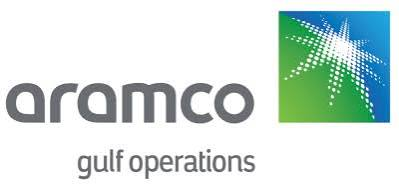
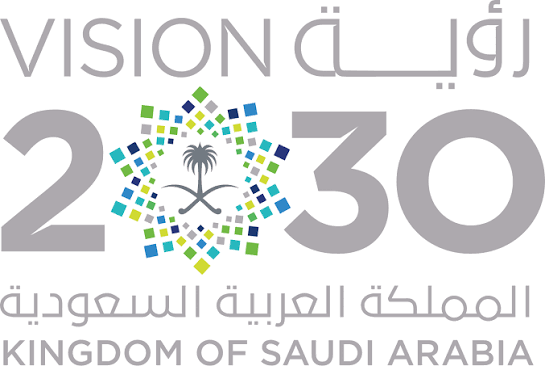

# 矩阵起源签约沙特阿美旗下 AGOC，以 MOI 加速拓展中东企业级 Data+AI 市场

近日，矩阵起源正式签约沙特阿美旗下 Aramco Gulf Operations Company（以下简称“AGOC”）。双方将依托矩阵起源一站式 Data + AI 平台 MatrixOne Intelligence（以下简称“MOI”），围绕油气数据分析、智能招聘、智能运营等多个方向展开合作，共同探索人工智能在大型能源企业核心业务场景中的规模化应用。

此次签约是矩阵起源拓展中东市场的重要进展。通过与沙特阿美这样的国际大型能源企业合作，矩阵起源将进一步推动 MOI 的多模态数据处理、知识工程、模型服务、Agent 运行和智能工作流能力进入实际业务流程，助力客户将复杂、分散的企业数据转化为安全、可控、可持续的智能生产力。

## 签约大型能源企业，深入中东企业级 AI 市场

AGOC 是沙特阿美的全资子公司，参与沙特阿拉伯与科威特之间海上划分区的油气业务运营，业务涉及大型跨境能源资产、复杂海上油气作业以及多机构协同，对数据安全、运营连续性和业务治理能力具有严格要求。

能源行业拥有大量专业数据和复杂业务流程，是企业级 AI 价值最为集中的领域之一。从油气数据分析、生产运营到人才管理和组织协同，企业不仅需要模型具备理解和生成能力，还需要完整的数据基础、明确的业务规则以及安全可控的运行机制。

与此同时，中东地区正在持续加大数字基础设施和人工智能领域的投入，能源、政府、金融和大型企业的智能化需求加速释放。如何将 AI 从单点技术验证转化为可规模化部署、可持续运营的生产系统，正在成为当地企业数字化升级的重要方向。

尤其在沙特阿拉伯，“2030 愿景”（Vision 2030）将推动经济多元化、降低对石油的单一依赖、加快数字化与智能化转型列为国家级战略，人工智能与数据基础设施正是其中的重要支柱。矩阵起源与 AGOC 的此次合作，也顺应了这一区域数字化升级与智能化转型的大趋势。

矩阵起源此次签约 AGOC，既是 MOI 进入国际大型能源企业实际业务场景的重要实践，也为矩阵起源持续拓展中东企业级 AI 市场奠定了基础。

## 以 MOI 为核心，推动 AI 深入多元业务场景

MOI 是矩阵起源面向企业级 AI-Native 应用与生产级 Agent 打造的一站式 Data + AI 平台。平台以 MatrixOne AI-Native Database 为数据底座，统一多模态数据管理、知识构建、模型服务、Agent 运行、长期记忆与持续优化等能力，为企业提供从数据治理到智能应用落地的完整技术支撑。

此次合作不局限于单一应用，而是以 MOI 为核心平台，面向 AGOC 的实际业务需求，在多个方向探索企业级 AI 的应用价值。

### 油气数据分析

针对能源行业数据来源多样、专业性强、数据量大等特点，MOI 可统一管理结构化与非结构化数据，帮助企业对业务数据、技术资料和历史知识进行整合、分析与智能调用。

结合大模型、知识工程与 Agent 能力，平台能够为专业数据查询、信息关联、趋势分析和辅助决策提供支撑，提升企业数据资源的利用效率。

### 智能运营

围绕大型能源企业复杂的运营管理体系，MOI 可将企业知识、业务规则和数据处理流程组织为可执行、可追踪的智能工作流。

通过连接不同数据源和业务系统，AI 能够参与信息处理、任务协同、异常识别、知识检索和运营分析，帮助企业提高流程效率与跨部门协作能力，为智能运营体系建设提供平台基础。

### 智能招聘与人才管理

面对大规模、多语言的人才招聘需求，MOI 可对岗位描述、候选人材料及相关数据进行统一接入和智能处理，支持 PDF、Word、扫描件、图片以及英语、阿拉伯语等多种格式和语言。

平台能够完成信息解析、关键字段提取、岗位匹配、统一评分和结果展示，帮助招聘团队提高工作效率与评估一致性。在此基础上，相关能力还可以进一步沉淀为可持续复用的人才数据和智能工作流，为企业人才管理提供数据支撑。

## 从数据到 Agent，构建企业级 AI 落地闭环

大型企业部署 AI，真正的挑战往往不只在于模型本身，而在于如何让数据、模型、业务规则和应用流程形成完整闭环。

企业内部的大量价值信息通常分散在数据库、业务系统、文档、图片、报表和专业资料中。数据格式、管理方式和访问权限各不相同，难以直接被 AI 理解和调用。

MOI 将多模态数据管理、模型服务、知识工程和 Agent 工作流统一在一个平台中，帮助企业完成从数据接入、解析治理到智能应用构建的全过程：

- 统一接入数据库、业务系统、文档、图片及其他多模态数据；
- 将分散信息转化为可治理、可追溯、可供 AI 调用的数据资产；
- 通过知识工程和语义理解，形成面向业务场景的专业知识能力；
- 将企业规则、模型能力和业务流程编排为可执行的智能工作流；
- 支持 Agent 在明确权限和业务边界内参与实际任务；
- 对数据来源、模型调用、处理过程和输出结果进行持续管理与追溯。

依托这一能力体系，企业可以从单点 AI 应用出发，逐步扩展至更多部门和业务流程，形成统一、可复用的企业级 AI 基础设施，降低不同场景重复建设的成本。

## 安全、可控、可落地，满足能源企业治理要求

对于大型能源企业而言，AI 系统不仅需要具备处理效果和运行性能，还必须满足严格的数据安全、数据主权、权限管理和合规要求。

此次合作在方案设计中充分考虑数据接入、存储、处理、模型调用、计算资源和结果导出等环节的边界控制，并结合当地基础设施和生态合作伙伴能力，构建符合客户要求的部署与服务模式。

MOI 能够对数据资源、模型服务和智能工作流进行统一管理，使每个环节具备明确的输入、处理逻辑与输出，为权限控制、过程审计和结果追溯提供支撑。

针对不同业务场景在数据量、实时性和资源使用方面的差异，平台还可根据实际业务需求灵活配置资源，在处理效果、系统性能、安全治理和总体成本之间取得平衡。

## 以标杆项目为支点，打开中东市场增长空间

中东是全球数字化和人工智能投入增长较快的市场之一。以能源行业为代表的当地大型企业，拥有丰富的数据资产、复杂的业务体系以及明确的智能化升级需求，为企业级 AI 平台提供了广阔的应用空间。

与此同时，中东企业对 AI 服务商的要求也在不断提高。除了模型能力，企业更加关注数据治理、私有化部署、系统集成、本地化服务以及规模化运营能力。具备 Data + AI 一体化能力，并能够深入实际业务流程的平台，将获得更多发展机会。

此次签约 AGOC，是矩阵起源推进国际化战略、深入中东企业级 AI 市场的重要一步。通过服务具有复杂业务体系和严格治理要求的大型能源企业，矩阵起源将进一步积累能源行业解决方案、本地化交付和生态协同经验。

未来，矩阵起源将继续加强与中东当地客户及生态合作伙伴的协同，以 MOI 为企业级 AI 技术底座，将多模态数据处理、油气数据分析、知识工程、智能运营和 Agent 工作流等能力拓展至更多业务场景。

矩阵起源也将以此次签约为新起点，加速服务中东能源及更多行业客户，推动 AI 从单点应用走向企业级、平台化和规模化落地。

## 关于 AGOC

Aramco Gulf Operations Company（AGOC）成立于 2000 年，是沙特阿美的全资子公司，也是沙特方面参与沙特—科威特海上划分区油气资源管理与运营的重要主体。

AGOC 承担相关区域油气资源的联合开发、生产运营与长期管理，业务涉及跨境能源资产和复杂的海上油气作业体系，对安全合规、运营连续性与跨机构协同具有严格要求。凭借在大型能源资产运营和复杂项目管理方面的专业能力，AGOC 是沙特能源产业体系中的重要运营力量。
