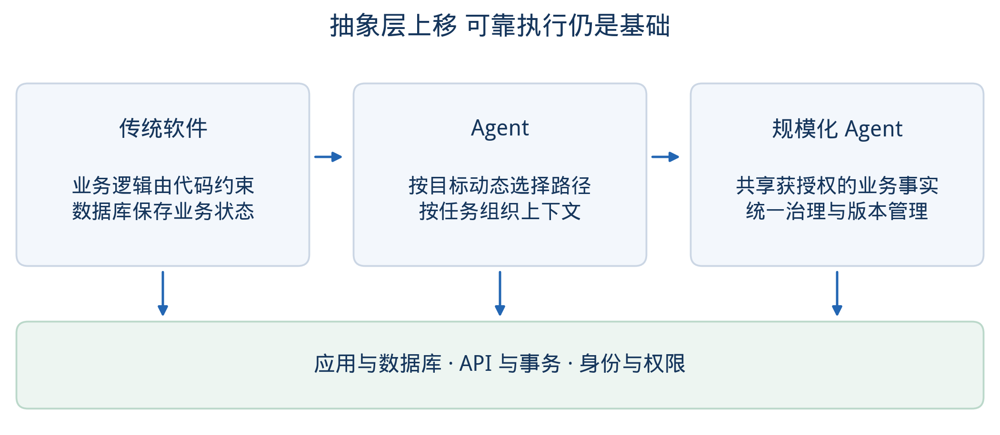
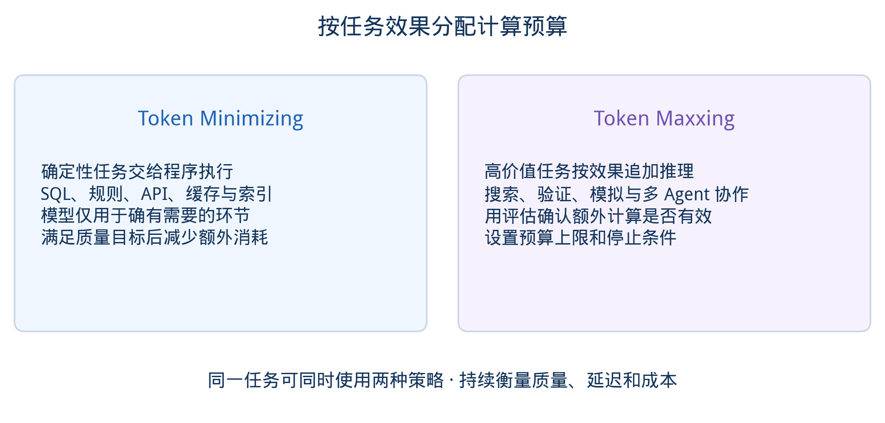
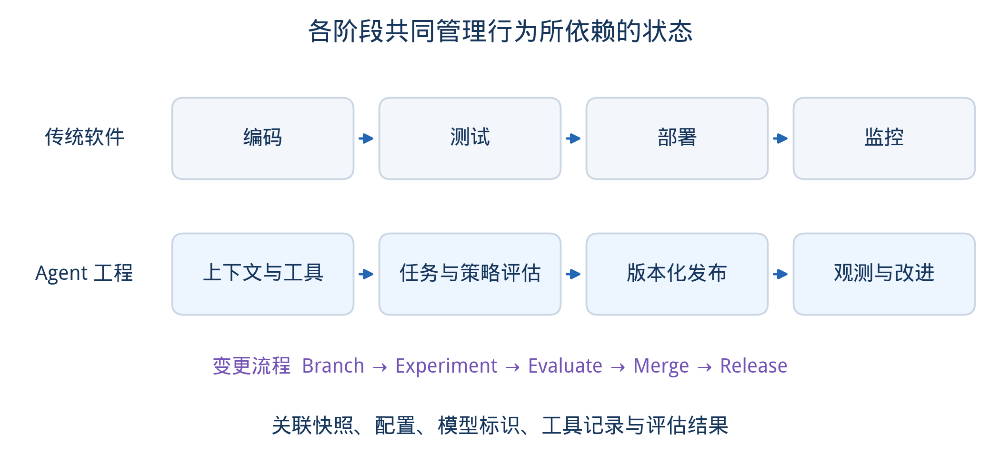
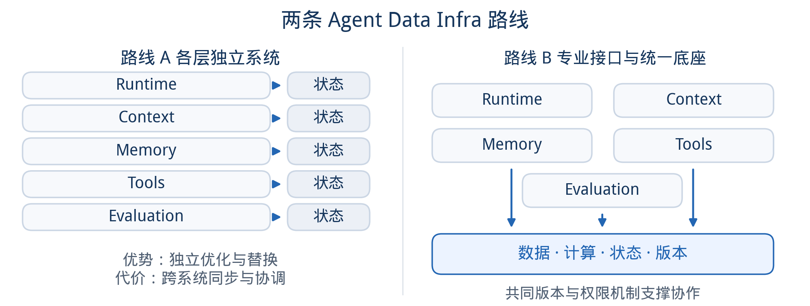
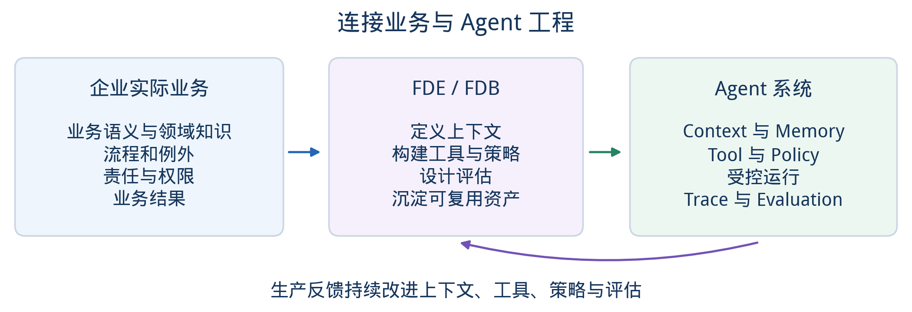
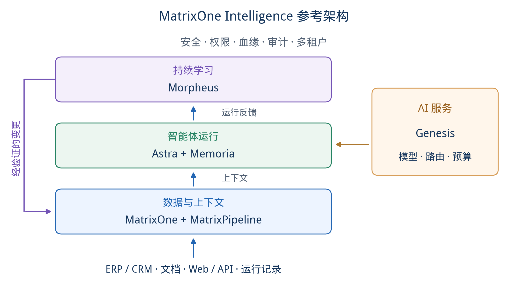

# 从 App + Database 到 Agent + Context：下一代企业 AI Infra 的架构推演

在确定性软件与概率性智能之间，企业需要一套新的工程体系：既让传统软件继续承担可靠执行，也让 Agent 可以获得上下文、记忆、预算、治理与持续学习。

矩阵起源 MatrixOrigin 技术观察 · 2026.09

核心判断：Agent 把新的认知计算叠加在确定性软件之上。下一代 AI Infrastructure 的任务，是让业务执行、上下文、运行状态与反馈在同一套工程和治理体系中可靠协作。

## 引子 Agent 如何与传统软件共同演进

过去几十年，企业软件的基本结构非常稳定：应用承载业务逻辑，数据库保存业务状态，API 把系统连接起来。即便从单体走到微服务，从本地机房走到云原生，这个基本契约也没有改变——大多数执行路径在运行前已经由代码确定。

Agent 给软件增加了另一种运行方式。面对一个目标，它可能在执行过程中决定检索什么、调用哪些工具、走几步、什么时候停止，也可能把结果写回系统，并影响下一次运行。行为的一部分从“预先写在代码里”转移到了运行时。[3]

这并不意味着 App、Database、API、事务和 SQL 会退出历史舞台。交易、账务、库存、权限、身份、清结算等核心系统仍然需要高度确定、可审计的软件。更准确的说法是：Agent 把一个新的、带有不确定性的认知计算层叠加到了过去五十年的确定性软件体系之上。

当上层越来越动态，底层的确定性反而更重要。企业真正需要解决的问题，是如何让这两个世界可靠地一起工作。

## 一 从 App + Database 到 Agent + Context 是抽象层继续上移

软件工程史可以看作一条不断提高抽象层级的曲线。机器指令之上有编程语言，函数之上有对象和服务，服务器之上有云平台。新的抽象通常建立在既有能力之上，并把其中可以复用的部分沉淀为基础设施。

传统企业软件通常围绕功能和服务组织：给定输入，执行由代码约束的业务逻辑。Agent 更接近“能力”的抽象：给定目标、上下文和约束，系统在运行时规划如何完成任务。执行路径可以变化，满足业务要求的结果也未必只有一个。

因此，影响 Agent 行为的状态也比数据库中的业务记录更广。本文所说的“业务上下文”，包括与任务相关的业务事实、语义、规则和访问约束；“推理上下文”则是一次模型调用实际接收的信息，是按任务和权限从可用信息中选取的部分。AI State 的范围更广，还包括任务进度、长期记忆、模型与工具配置，以及用于审计和评估的运行记录。三者相互关联，但并不等同。[4]

同一个模型，在不同企业、不同权限、不同历史和不同业务语义下，会表现出完全不同的能力。模型提供通用推理能力，企业差异化越来越多地沉淀在私有 Context、运行状态和业务执行能力中。

*图 1｜从 App + Database 到 Agent + Context：抽象层继续上移，底层确定性基础设施仍然存在。*

## 二 两种计算策略 Token Minimizing 与 Token Maxxing

Agent 时代很容易陷入一个误区：既然模型越来越强，就让模型做更多事情。真正进入企业生产环境后，成本、延迟、稳定性和业务价值会迫使架构师做更细的分工。

第一种策略是 Token Minimizing。能用 SQL、规则、API、缓存或结构化索引可靠解决的事情，没有必要每次都调用昂贵的大模型推理。订单金额计算、权限检查、库存扣减、指标聚合和确定性校验，应由相应的程序与业务系统执行。对于确实需要模型的环节，可以在满足质量要求的前提下使用小模型。目标是在完成任务的同时减少不必要的 Token 消耗、延迟和结果波动。

第二种策略是 Token Maxxing：在收益可以通过评估验证时，为高价值任务追加推理预算。复杂投研、法律分析、代码迁移、战略规划和复杂采购决策中，更好结果的价值可能高于额外计算成本。多轮推理、搜索、验证、模拟和多 Agent 协作都可能有帮助，但更多 Token、更长上下文并不必然带来更好结果；无关信息还可能干扰判断。因此，追加计算应有质量评估、预算上限和停止条件。[3][4]

这两种策略可以出现在同一个任务的不同步骤中。基础设施需要按任务价值与约束选择模型、上下文和推理预算，并持续衡量质量、延迟和成本是否满足目标。AI Infra 需要优化完成任务的整体效果，而不只是 Token 单价或使用量。

*图 2｜Token Minimizing 与 Token Maxxing：按任务效果分配计算预算，并设置停止条件。*

## 三 从 1 个 Agent 到 10000 个 Agent 工程问题发生质变

一个 Agent 可以靠几名工程师把数据库、向量库、RAG、工具和日志拼起来。十个 Agent 也可以复制这套做法。到了几百、几千个 Agent，系统面对的就不再是同一个工程问题。

我们用 Trust、Cost、Scale 三个词概括企业 AI 规模化的主要挑战：决策依据能否追溯、运行过程能否审计；数据、模型和算力能否复用；一个成功场景能否低成本复制到更多部门和流程。微软的 2026 Work Trend Index 与 Google Cloud 的基础设施报告也分别讨论了 Agent 规模化带来的组织和基础设施要求。[1][2]

一个 Agent 的 Memory 被错误信息污染，可能影响一次任务；一百个 Agent 共享这段 Memory，影响会扩散。少量 Agent 跨系统拼接 Context 的成本可能可控；当大量 Agent 持续跨系统读写时，数据移动、重复处理、跨系统权限一致性和状态对齐都会成为基础设施问题。

可以把企业 Agent 的演进粗略看成三个阶段：先让一个 Agent 进入一个核心流程；再让 10–100 个 Agent 跨部门复制和协作；进一步面对 1,000–10,000 个 Agent 的统一治理、版本管理和持续优化。这些数字是架构压力测试的假设，并非预测或统一门槛。实际压力还取决于并发量、读写频率、共享状态规模和隔离要求。

## 四 Agent 时代的开发测试部署运维与迭代

传统软件生命周期通常可以写成 Code → Test → Deploy → Monitor。Agent 系统里，影响行为的对象明显更多：Data、Context、Prompt、Skill、Tool、Memory、Policy、Model、Evaluation Set 和运行环境都可能改变最终结果。

开发从“写代码”扩展为构建上下文、工具和策略；测试在单元测试、集成测试之外，增加任务评估、运行轨迹检查、模拟和策略测试；部署除了发布二进制或容器镜像，还可能切换模型、Prompt、Context 规则、Memory schema 和 Tool。线上调试需要重建关键输入和配置版本，检查 Agent 当时接收了什么信息、调用了哪些工具，以及环境中实际发生了什么变化。[5]

这意味着 Agent 工程需要一种更接近 Branch → Experiment → Evaluate → Merge → Release → Replay / Rollback 的生命周期。生产 Trace 会不断产生新的失败案例，Evaluation Set 也会随业务持续更新。开发和运行之间的边界会比传统软件更模糊。

软件工程的很多成熟原则仍然有效：版本控制、隔离、灰度、回滚、可观测和最小权限。被治理的对象则从代码扩展到影响行为的关键状态及其依赖版本。对无法纳入统一快照的外部系统，需要记录可获得的版本信息、调用输入和返回结果；权限必须在数据访问和工具执行时校验。

*图 3｜Agent 工程生命周期：开发、测试、发布和运行阶段需要共同管理行为所依赖的状态。*

## 五 Context 与 AI State 成为新的基础设施对象

企业 AI 真正困难的地方，很少是把一个模型 API 接进来。困难在于让模型理解这个企业是怎么运行的。一个采购 Agent 需要理解供应商、历史价格、品类规则、合同条款、审批权限和当前预算；一个售后 Agent 需要理解客户、产品、工单、服务等级和例外处理。

这些信息分散在 ERP、CRM、MES、文档、邮件、知识库、会议记录、工具调用和人的经验中。把它们变成生产级 Agent 可用的业务上下文，需要处理语义、权限、时效、血缘和版本，并在运行时选取适合当前任务的信息。业务上下文可以视为一层动态的业务运行模型，单次模型调用只接收其中必要且获授权的部分。

长期 Memory、任务进度、Policy、Tool 配置和模型版本也会影响下一步行为。Trace 和 Evaluation 则记录运行结果并支持后续改进。审计一次决策，需要把当时使用的关键输入、配置、可见状态和实际执行结果关联起来，从而回答：Agent 依据什么信息采取了这一步行动？

我们把这种能力称为“受治理的业务上下文”：既让 Agent 获得相关事实，也提供理解这些事实所需的业务含义、适用条件和访问边界。语义检索是其中一种能力，生产系统还需要处理事实的时效、权限和依赖关系。

## 六 两条 Agent Data Infra 路线 Best of Breed 与 Unified Core

第一条路线是为不同职责选择专业系统。关系数据库负责业务数据，向量检索系统负责语义检索，对象存储保存文档，Memory 使用独立存储，Tool 由注册与发现服务管理，Trace 和 Evaluation 进入观测平台。这是一种常见的组装方式，优势包括组件成熟、可以分别优化、团队职责清晰，以及按需替换组件的灵活性。

问题通常在规模扩大后出现。同一份业务事实可能经过多套处理链路生成索引；权限需要跨系统传递；数据变更与索引更新之间可能存在时间差；一次 Agent 决策对应的数据、上下文、记忆、提示词、策略、工具和模型版本也更难对齐。如果只保留日志而没有记录关键输入、版本和外部返回结果，重放就难以重建当时的决策条件。

第二条路线是让上层继续保留专业接口，同时尽可能统一底层的数据、计算、状态和版本能力。Context 仍有自己的语义和编译过程，Memory 仍然需要生命周期与共享规则，Runtime 仍然处理执行和隔离；只是这些抽象共享更统一的企业状态底座。

这条路线有机会减少跨系统数据搬运和重复处理，并为统一治理、版本管理与重放提供基础。收益来自共同的版本标识、快照机制、权限控制和运行时协作，而不是把数据放进同一个数据库就能自动获得；不同检索方式仍可能需要各自的索引。事务、分析、全文、向量和流式负载的资源特征也不同，统一底座需要工作负载隔离、调度和弹性，并保留开放接口。我们选择统一关键状态与治理，同时保留专业抽象和渐进接入能力。

*图 4｜两条 Agent Data Infra 路线：各层独立系统与“专业接口 + 统一底座”。*

## 七 统一数据与计算在跨层和跨 Agent 协作中的价值

以销售 Agent 为例。准备一次客户拜访，可能同时需要 CRM、合同、历史会议纪要、报价记录、产品资料和最近的支持工单。在碎片化架构中，这些数据分别经过 ETL、全文索引、向量化和权限映射，最后再由应用层拼 Context。统一底座的价值不是简单减少数据库数量，而是让结构化查询、全文、向量、事件流和权限尽量靠近同一份业务事实。

再看多 Agent 协作。采购 Agent 发现供应商价格异常，可能触发风险 Agent、合同 Agent 和财务 Agent。四个 Agent 需要共享事实，又不能拥有相同权限；需要围绕同一业务事件协作，又可能采用不同的策略分支。共享状态底座可以更自然地支持“一份事实、多种受治理视图”。

长期 Memory 更能说明问题。Agent Memory 会经历写入、总结、遗忘、共享、隔离、合并和回滚。如果错误事实进入共享 Memory，企业需要知道它从哪里来、影响了哪些 Agent、能否恢复到污染前的版本。到了这个阶段，版本能力已经从开发便利变成系统可靠性机制。

## 八 从 Git for Data 到 Git for AI State

软件工程能够规模化，很大程度上得益于代码版本管理。Branch、Diff、Merge、Rollback 支持并行开发、变更审查和发布恢复。我们在 MatrixOne 中将类似操作扩展到数据，为数据分支、差异比较、合并和恢复提供数据库原生能力。[6]

Agent 工程进一步要求关联 Data、Context、Memory、Prompt、Skill、Policy、Tool、Model、Trace 和 Evaluation。不同对象不必采用相同的存储方式，但一次运行应能关联它所使用的数据快照、配置版本、模型标识、工具输入输出及评估记录。这些关联让团队能够追溯问题，并在受控环境中比较不同上下文或策略下的结果。

这就是我们所说的从“Git for Data”走向“Git for AI State”。团队可以为上下文和记忆建立实验分支，在检查语义冲突、权限和评估结果后合并经验证的变更。Memoria 将这种版本管理用于长期记忆。[7] 这里需要区分三种能力：恢复保存过的历史状态与运行记录；基于记录重新执行并比较结果；处理业务动作带来的外部影响。重新调用模型不保证输出逐字相同，恢复内部状态也不会自动撤销已经发送的邮件或完成的付款。此类动作需要相应的业务补偿或人工处理。[5][10]

## 九 FDE 在 Agent 时代的工程职责

软件工业长期通过标准产品和配置复用通用能力，具体业务中的差异仍需要工程人员处理。Agent 进入核心流程后，这项工作会延伸到业务语义和行为评估：系统必须理解企业如何报价、采购、审批、交付、风控，以及那些只存在于实际操作经验中的例外。

与此同时，Agent 本身又是一个概率性系统。企业真实业务强调语义、责任、权限和结果，AI 系统强调数据、工具、模型、Prompt、Evaluation 和持续迭代。两边之间天然需要翻译和桥梁。

这正是 Forward Deployed Engineer（FDE）价值上升的原因。FDE 需要把企业运行方式落实为 Agent 可用的 Context、Tool、Policy 和 Evaluation，并持续验证它们在生产环境中的效果。这项工作需要业务判断、数据能力、软件工程和生产治理经验。

Demo 的输入通常经过人工整理，生产环境却包含历史系统、冲突的定义、隐含规则、权限边界和异常流程。FDE 需要逐步把这些约束转化为可执行、可检验的工程对象，并在上线后持续看 Trace、补 Context、改 Tool、调 Policy、建 Eval。在矩阵起源，我们将这一角色称为 Forward Deployed Builder（FDB），强调对业务结果负责，并将项目中的经验沉淀为可复用的上下文、工具和评估资产。

*图 5｜FDE 与矩阵起源的 FDB：连接业务、Agent 工程和生产反馈。*

## 十 MatrixOrigin 的统一底座与专业 Agent 抽象

MatrixOne Intelligence 体现了我们对这一架构方向的实现：AI 服务、数据与上下文、智能体运行、持续学习四类能力相互配合，安全、治理、血缘、审计、基于角色的访问控制（RBAC）和多租户能力贯穿其中。

*图 6｜MatrixOne Intelligence 四类能力协同：业务数据进入上下文层，模型服务支持运行时，反馈经验证后用于持续改进。*

Genesis 提供模型接入、路由、用量计量和预算控制，为模型与推理预算选择提供基础。[9] MatrixOne 提供统一数据计算、存储和 Git for Data；MatrixPipeline 把业务系统、文档、Web、工具调用和运行轨迹加工成受治理的业务上下文。Astra 负责 Agent 的受控执行、权限、隔离、运行记录与重放，以及多 Agent 编排；Memoria 管理长期记忆、分支、合并、回滚与共享。[7][8] Morpheus 把 Trace、Evaluation 和反馈引入数据、上下文与策略的持续优化，变更经评估验证后再进入发布流程。

我们的设计原则是：让 Agent 的专业抽象继续分层演进，让影响行为的关键企业状态在共同的治理体系下协作。对于已有 ERP、CRM、MES、数据库和文档系统的企业，落地应从具体流程开始，通过开放接入、明确系统边界和逐步扩展共享能力完成演进。

## 十一 万亿 Agent 的架构思想实验

“万亿 Agent”更适合作为架构思想实验，而不是市场预测。假设未来每个员工、业务对象和软件流程都可以调用多个短期或长期 Agent，那么两类工作负载的重要性可能显著上升。

第一类是大量 Agent 协作。Agent 围绕同一客户、订单、项目或供应链事件临时组成团队，共享获授权的上下文、传递任务，并按规则使用记忆。可治理的共享状态将成为重要的基础设施能力。

第二类是大量 Agent 开发与迭代。企业会同时维护大量 Agent、Prompt、Skill、Policy 和 Evaluation 版本，生产 Trace 持续产生新的失败案例。开发流程越来越接近 Agent DevOps / AI Factory：Branch、Experiment、Evaluate、Merge、Release、Replay、Rollback。

这时真正的问题已经不是“数据库会不会消失”，而是过去围绕单个应用组织的数据库、开发工具和运维体系，要如何演进为同时支撑确定性软件和概率性 Agent 的基础设施。

## 结语 让两种运行方式可靠协作

App + Database 仍然是企业数字世界的地基。Agent + Context 增加的是一种新的运行范式：执行路径更动态，需要在运行时持续组织数据、语义、权限、记忆、策略和反馈。

下一代基础设施需要在确定性业务执行与动态推理之间建立清晰边界：让适合程序处理的工作可靠执行，让有价值的推理获得合理预算，并记录关键输入、版本和执行结果，以支持测试、评估、审计和恢复。可逆的内部状态可以回滚，外部业务影响则按相应流程补偿或处理。

技术上需要新的基础设施；组织上，也需要一群能够在业务和 AI 之间翻译的人。FDE、Context Engineering、Agent Runtime、版本化 AI State，可能会一起构成下一代企业 AI 的工程体系。

数据库和传统软件会继续演进。随着更多 Agent 参与企业流程，它们仍将承担业务状态、可靠执行和治理等基础职责，并与新的上下文、运行时和评估能力共同构成企业 AI 基础设施。

## 参考资料

[1] Microsoft. [2026 Work Trend Index Annual Report: Agents, human agency, and the opportunity for every organization](https://www.microsoft.com/en-us/worklab/work-trend-index/agents-human-agency-and-the-opportunity-for-every-organization). 2026.

[2] Google Cloud. [2026 State of infrastructure in the agentic AI era](https://cloud.google.com/resources/content/state-of-infrastructure-in-the-agentic-ai-era). 2026.

[3] Anthropic. [Building effective agents](https://www.anthropic.com/engineering/building-effective-agents). 2024-12-19.

[4] Anthropic. [Effective context engineering for AI agents](https://www.anthropic.com/engineering/effective-context-engineering-for-ai-agents). 2025-09-29.

[5] Anthropic. [Demystifying evals for AI agents](https://www.anthropic.com/engineering/demystifying-evals-for-ai-agents). 2026-01-09.

[6] Gou et al. [Version Control System for Data with MatrixOne](https://arxiv.org/abs/2604.03927). arXiv:2604.03927, 2026.

[7] MatrixOrigin. [Memoria project documentation](https://github.com/matrixorigin/Memoria).

[8] MatrixOrigin. [Astra product architecture](https://www.matrixorigin.io/astra).

[9] MatrixOrigin. [Genesis documentation](https://docs.matrixorigin.cn/moi/en/5.0/introduction/genesis.html).

[10] Microsoft Learn. [Compensating Transaction pattern](https://learn.microsoft.com/en-us/azure/architecture/patterns/compensating-transaction). 2026.

资料访问日期 2026 年 9 月 14 日

