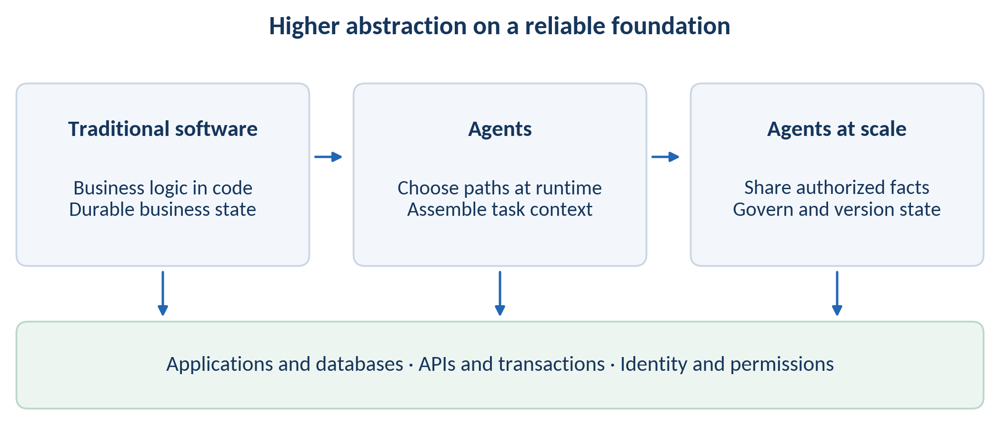
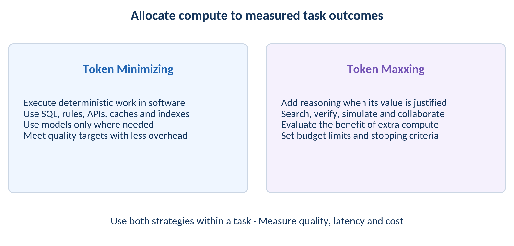
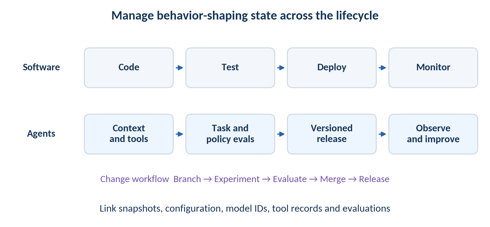
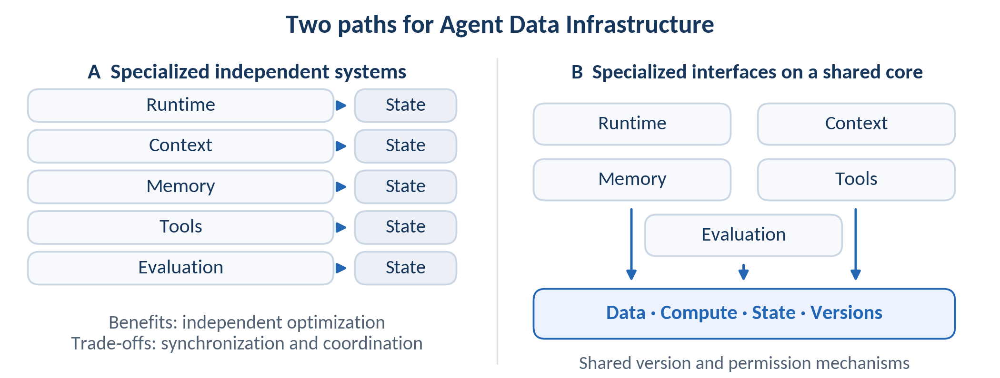
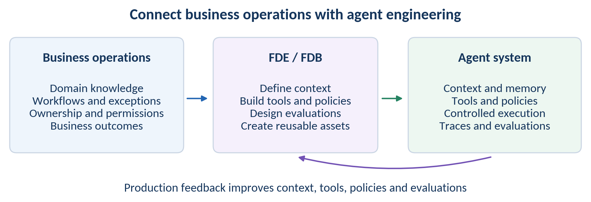
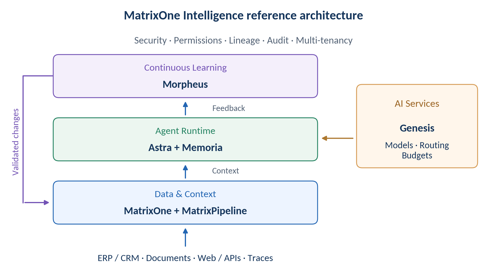

# From App + Database to Agent + Context: Rethinking the Architecture of Enterprise AI Infrastructure

Enterprise AI must connect two worlds: deterministic software that executes reliably and probabilistic agents that reason, use context and learn from feedback.

MatrixOrigin Technology Perspective · September 2026

Core thesis: agents add cognitive computation to deterministic software. The next enterprise AI infrastructure stack must bring business execution, context, runtime state and feedback into a coherent engineering and governance framework.

## How agents and traditional software evolve together

For decades, enterprise software has rested on a stable contract: applications hold business logic, databases hold durable business state, and APIs connect systems. Even as the industry moved from monoliths to microservices and from data centers to cloud-native platforms, most execution paths were still decided in code before runtime.

Agents add another mode of execution. Given a goal, an agent may decide what to retrieve, which tools to call, how many steps to take, when to stop and what to write back. Part of the behavior that used to be fixed in code is now assembled at runtime. [3]

That does not make applications, databases, APIs, transactions or SQL obsolete. Accounting, inventory, identity, permissions, settlement and many other core systems still need deterministic, auditable software. A more accurate description is that agents add a probabilistic cognitive layer on top of fifty years of deterministic software engineering.

The more dynamic the upper layer becomes, the more valuable a reliable deterministic foundation becomes. The architectural challenge is to make those two worlds work together.

## 1 From App + Database to Agent + Context is another rise in abstraction

The history of software engineering is a steady climb in abstraction. Programming languages build on machine instructions, objects and services organize functions, and cloud platforms build on servers. New abstractions typically rely on existing capabilities and turn reusable parts into infrastructure.

Traditional enterprise software is usually organized around functions and services: given an input, execute business logic constrained by code. An agent is closer to a capability abstraction: given a goal, context and constraints, plan how to complete the task at runtime. The path can vary, and more than one outcome may satisfy the business requirement.

The state that shapes agent behavior is therefore broader than the rows in a business database. In this article, business context means task-relevant facts, semantics, rules and access constraints. Inference context means the information supplied to a particular model call, selected for the task and filtered by permissions. AI state is broader still: it includes task progress, long-term memory, model and tool configuration, and the records used for audit and evaluation. These concepts are related, but they are not interchangeable. [4]

The same model behaves very differently across companies because proprietary context, operating state and execution capability increasingly hold the enterprise-specific value.

*Figure 1 | From App + Database to Agent + Context: abstraction rises while deterministic foundations remain.*

## 2 Token Minimizing and Token Maxxing

Agentic AI creates a temptation to let the model do everything. Production systems quickly force a more disciplined division of labor because cost, latency, variance and business value matter.

The first strategy is Token Minimizing. If SQL, rules, APIs, caches or structured indexes can reliably solve a problem, there is little reason to invoke expensive model reasoning every time. Order calculations, permission checks, inventory updates, metric aggregation and deterministic validation should be handled by the relevant software and business systems. Where a model is needed, a smaller model may be appropriate if it meets the quality target. The goal is to complete the task while reducing unnecessary token use, latency and output variance.

The second strategy is Token Maxxing: allocating additional inference budget to high-value tasks when evaluations justify the benefit. In complex research, legal analysis, code migration, strategy and procurement, a better result may be worth more than the additional compute. Multi-step reasoning, search, verification, simulation and multiple agents can help. More tokens and longer context, however, do not guarantee better results; irrelevant information can impair judgment. Additional compute therefore needs quality evaluation, a budget limit and stopping criteria. [3][4]

Both strategies can appear in different steps of the same task. Infrastructure must select models, context and inference budgets according to task value and constraints, then measure whether quality, latency and cost meet the target. The objective is the overall effectiveness of task execution, not token price or token volume alone.

*Figure 2 | Token Minimizing and Token Maxxing: allocate compute according to measured task outcomes, with explicit stopping criteria.*

## 3 Scaling from one agent to ten thousand agents

One agent can be assembled by a few engineers using a database, vector store, RAG pipeline, tools and logs. Ten agents can copy the pattern. At hundreds or thousands of agents, the organization is dealing with a different class of infrastructure problem.

At MatrixOrigin, we summarize the main scaling challenges as Trust, Cost and Scale: can decision inputs be traced and execution audited; can data, models and compute be reused; and can a successful use case be replicated across departments and processes at reasonable cost? Microsoft's 2026 Work Trend Index and Google Cloud's infrastructure report also examine the organizational and infrastructure requirements of scaling agents. [1][2]

An incorrect memory may affect one agent's task; shared by a hundred agents, its impact can spread. Cross-system context assembly may be affordable for a small population. With large numbers of agents reading and writing continuously, data movement, duplicate processing, consistent permissions across systems and state alignment become infrastructure concerns.

A useful stress test is to think in stages: one agent enters a core process; 10–100 agents replicate and collaborate across departments; 1,000–10,000 agents require unified governance, versioning and continuous optimization. These numbers are architectural assumptions, not forecasts or universal thresholds. Actual load also depends on concurrency, read and write frequency, shared-state volume and isolation requirements.

## 4 Engineering the agent lifecycle

The classic software lifecycle can be simplified to Code → Test → Deploy → Monitor. An agent system has many more behavior-shaping objects: Data, Context, Prompt, Skill, Tool, Memory, Policy, Model, Evaluation Set and environment.

Development expands from writing code to constructing context, tools and policies. Testing adds task evaluations, trajectory checks, simulations and policy tests to unit and integration tests. Deployment may change the model, prompt, context rules, memory schema and tools alongside a binary or container image. Production debugging must reconstruct key inputs and configuration versions, inspect which tools were called, and establish what actually changed in the environment. [5]

The lifecycle begins to resemble Branch → Experiment → Evaluate → Merge → Release → Replay / Rollback. Production traces continuously create new failure cases; evaluation sets evolve with the business. The boundary between development and operations becomes less rigid.

Mature software engineering principles still apply: versioning, isolation, canaries, rollback, observability and least privilege. Governance expands from code to the key state and dependency versions that shape behavior. For external systems outside a common snapshot, record the available version information, call inputs and returned results. Enforce permissions when accessing data and executing tools.

*Figure 3 | Agent engineering lifecycle: build, test, release and operations must jointly manage the state that shapes behavior.*

## 5 Context and AI State become infrastructure objects

The hard part of enterprise AI is rarely calling a model API. It is teaching the system how the business actually works. A procurement agent needs suppliers, historical prices, category rules, contract clauses, approval authority and current budgets. A support agent needs customers, products, cases, service levels and exception handling.

Those facts are scattered across ERP, CRM, MES, documents, mail, knowledge systems, meeting records, tool calls and human experience. Turning them into production business context requires semantics, permissions, freshness, lineage and versioning, followed by task-specific selection at runtime. Business context can be understood as a dynamic model of business operations; each model call receives only the relevant, authorized portion.

Long-term memory, task progress, policies, tool configuration and model versions also influence the next action. Traces and evaluations record outcomes and support later improvements. Auditing a decision means linking the key inputs, configuration, visible state and actual execution results so the enterprise can identify the information behind each action.

We call this governed business context: giving agents relevant facts together with their business meaning, conditions of use and access boundaries. Semantic retrieval is one part of this capability. Production systems must also manage the freshness, permissions and dependencies of those facts.

## 6 Comparing two paths for Agent Data Infrastructure

The first path selects specialized systems for different responsibilities. A relational database holds business data, a vector retrieval system supports semantic search, object storage holds documents, a memory store maintains long-term state, a registry manages tool discovery, and observability and evaluation systems collect traces. This is a common way to assemble agent stacks. Its benefits include mature components, independent optimization, clear ownership and flexibility to replace components as needed.

The costs often appear at scale. The same business fact may pass through several pipelines to produce indexes. Permissions must propagate across boundaries. Index updates may lag behind source changes. Aligning the data, context, memory, prompt, policy, tool and model versions behind a decision becomes harder. Logs alone cannot reconstruct the conditions of a past decision if key inputs, versions and external responses were not retained.

The second path keeps specialized interfaces but unifies more of the underlying data, compute, state and versioning substrate. Context keeps its own semantics and compilation process, memory keeps lifecycle and sharing rules, runtime keeps execution and isolation—but those abstractions share a more common enterprise state foundation.

This approach can reduce cross-system data movement and duplicate processing while supporting common governance, versioning and replay. Those benefits depend on shared version identifiers, snapshot mechanisms, access controls and runtime coordination; storing data in one database does not produce them automatically. Different retrieval methods may still need separate indexes. Transactional, analytical, vector, full-text and streaming workloads also have different resource profiles, requiring workload isolation, scheduling and elasticity. We choose to unify critical state and governance while preserving specialized abstractions, open interfaces and incremental adoption.

*Figure 4 | Two Agent Data Infra paths: independent best-of-breed systems vs. specialized interfaces on a unified core.*

## 7 Unified data and compute support cross-layer and cross-agent work

Consider a sales agent preparing for a customer meeting. It may need CRM records, contracts, meeting notes, pricing history, product documentation and recent support cases. In a fragmented architecture, each source passes through different ETL, indexing and permission systems before the application assembles context. The point of a unified foundation is not simply to deploy fewer databases; it is to keep structured queries, full text, vectors, event streams and permissions close to the same business facts.

Now consider multi-agent collaboration. A procurement agent spots an abnormal supplier price and triggers risk, contract and finance agents. They need the same underlying facts but not the same permissions; they collaborate around one event while potentially exploring different policy branches. A shared state substrate makes “one fact, multiple governed views” much more natural.

Long-term memory makes the case even clearer. Agent memory is written, summarized, forgotten, shared, isolated, merged and rolled back. If a false fact enters shared memory, the enterprise needs provenance, blast-radius analysis and recovery to a clean point. Versioning has moved from developer convenience to a reliability mechanism.

## 8 From Git for Data to Git for AI State

Software engineering scaled in part through code versioning. Branch, Diff, Merge and Rollback support parallel development, change review and release recovery. In MatrixOne, we extend similar operations to data, providing database-native branching, comparison, merging and recovery. [6]

Agent engineering also needs to link Data, Context, Memory, Prompt, Skill, Policy, Tool, Model, Trace and Evaluation. These objects need not share one storage format, but a run should identify its data snapshots, configuration versions, model identifiers, tool inputs and outputs, and evaluation records. These links make failures traceable and let teams compare context or policy variants in controlled environments.

This is what we mean by moving from Git for Data toward Git for AI State. Teams can branch context and memory, check semantic conflicts and permissions, run evaluations, and merge validated changes. Memoria applies this versioning model to long-term memory. [7] Three capabilities must be distinguished: restoring recorded historical state and execution records; re-executing a run for comparison; and handling the external effects of business actions. Calling a model again does not guarantee identical output, and restoring internal state does not automatically undo an email already sent or a payment already completed. Such effects require the relevant business compensation process or human intervention. [5][10]

## 9 The engineering responsibilities of FDEs in the agent era

The software industry has long reused common capabilities through standard products and configuration, while engineers handle the differences between businesses. As agents enter core workflows, this work extends into business semantics and behavioral evaluation. Systems must understand how a company quotes, buys, approves, delivers, manages risk and handles exceptions, including those captured only in operational experience.

At the same time, the agent system is probabilistic. The enterprise world is about meaning, responsibility, permissions and outcomes; the AI world is about data, tools, models, prompts, evaluations and iteration. A translation layer is unavoidable.

This is why Forward Deployed Engineers, or FDEs, become more important. They turn business operations into Context, Tools, Policies and Evaluations that agents can use, then continuously verify their effectiveness in production. The work requires domain judgment, data literacy, software engineering and production governance.

Demos typically use curated inputs. Production contains legacy systems, conflicting definitions, implicit rules, permission boundaries and exceptional workflows. FDEs turn these constraints into executable, testable engineering artifacts, then continue reading traces, refining context, improving tools, adjusting policies and building evaluations. At MatrixOrigin, we call this role Forward Deployed Builder, or FDB, emphasizing responsibility for business outcomes and the conversion of project experience into reusable context, tools and evaluation assets.

*Figure 5 | FDEs and MatrixOrigin's FDBs connect business operations, agent engineering and production feedback.*

## 10 MatrixOrigin combines a unified core with specialized agent abstractions

MatrixOne Intelligence implements our approach through four cooperating layers: AI Services, Data & Context, Agent Runtime and Continuous Learning. Security, governance, lineage, audit, role-based access control (RBAC) and multi-tenancy span these capabilities.

*Figure 6 | MatrixOne Intelligence: business data enters the context layer, model services support the runtime, and validated feedback drives improvement.*

Genesis provides model access, routing, usage metering and budget controls, forming a foundation for model and inference-budget selection. [9] MatrixOne provides unified data compute, storage and Git for Data; MatrixPipeline processes business systems, documents, web data, tool calls and traces into governed business context. Astra handles controlled execution, permissions, isolation, execution records and replay, and multi-agent orchestration. Memoria manages long-term memory, branching, merging, rollback and sharing. [7][8] Morpheus brings traces, evaluations and feedback into the continuous improvement of data, context and policies, with changes evaluated before release.

Our design principle is to let specialized agent abstractions evolve while the critical enterprise state that shapes behavior operates under common governance. Enterprises with existing ERP, CRM, MES, databases and document platforms can begin with a specific workflow, connect through open interfaces, define system boundaries and expand shared capabilities incrementally.

## 11 A trillion-agent architecture thought experiment

A trillion-agent world is best treated as an architecture thought experiment, not a market forecast. Suppose each employee, business object and software process can call multiple short- and long-lived agents. Two workloads could become substantially more important.

The first is large-scale agent collaboration. Agents form temporary teams around the same customer, order, project or supply-chain event, sharing authorized context, handing off work and using memory under defined rules. Governed shared state becomes an important infrastructure capability.

The second is massive agent development and iteration. Enterprises maintain large populations of agents, prompts, skills, policies and evaluation versions, while production traces continuously generate new failure cases. The engineering lifecycle increasingly resembles Agent DevOps / AI Factory: Branch, Experiment, Evaluate, Merge, Release, Replay, Rollback.

The interesting question is no longer whether databases disappear. It is how the database, developer tooling and operations stack—historically organized around individual applications—evolves to support deterministic software and probabilistic agents at the same time.

## Making two modes of execution work together reliably

App + Database remains the foundation of the enterprise digital world. Agent + Context adds a new runtime model in which execution is more dynamic and systems must continuously assemble data, semantics, permissions, memory, policies and feedback.

The next infrastructure stack must establish clear boundaries between deterministic business execution and dynamic reasoning. It must execute suitable work reliably in software, allocate reasonable budgets to valuable reasoning, and record key inputs, versions and outcomes for testing, evaluation, audit and recovery. Reversible internal state can be rolled back; external business effects require the appropriate compensation or recovery process.

Technically, that calls for new infrastructure. Organizationally, it also calls for people who can translate between business reality and AI possibility. FDEs, context engineering, agent runtimes and versioned AI state may become parts of the same engineering discipline.

Databases and traditional software will continue to evolve. As more agents participate in enterprise workflows, they will retain their responsibilities for business state, reliable execution and governance, working alongside context, runtime and evaluation capabilities to form enterprise AI infrastructure.

## References

[1] Microsoft. [2026 Work Trend Index Annual Report: Agents, human agency, and the opportunity for every organization](https://www.microsoft.com/en-us/worklab/work-trend-index/agents-human-agency-and-the-opportunity-for-every-organization). 2026.

[2] Google Cloud. [2026 State of infrastructure in the agentic AI era](https://cloud.google.com/resources/content/state-of-infrastructure-in-the-agentic-ai-era). 2026.

[3] Anthropic. [Building effective agents](https://www.anthropic.com/engineering/building-effective-agents). 2024-12-19.

[4] Anthropic. [Effective context engineering for AI agents](https://www.anthropic.com/engineering/effective-context-engineering-for-ai-agents). 2025-09-29.

[5] Anthropic. [Demystifying evals for AI agents](https://www.anthropic.com/engineering/demystifying-evals-for-ai-agents). 2026-01-09.

[6] Gou et al. [Version Control System for Data with MatrixOne](https://arxiv.org/abs/2604.03927). arXiv:2604.03927, 2026.

[7] MatrixOrigin. [Memoria project documentation](https://github.com/matrixorigin/Memoria).

[8] MatrixOrigin. [Astra product architecture](https://www.matrixorigin.io/astra).

[9] MatrixOrigin. [Genesis documentation](https://docs.matrixorigin.cn/moi/en/5.0/introduction/genesis.html).

[10] Microsoft Learn. [Compensating Transaction pattern](https://learn.microsoft.com/en-us/azure/architecture/patterns/compensating-transaction). 2026.

Sources accessed September 14, 2026.
