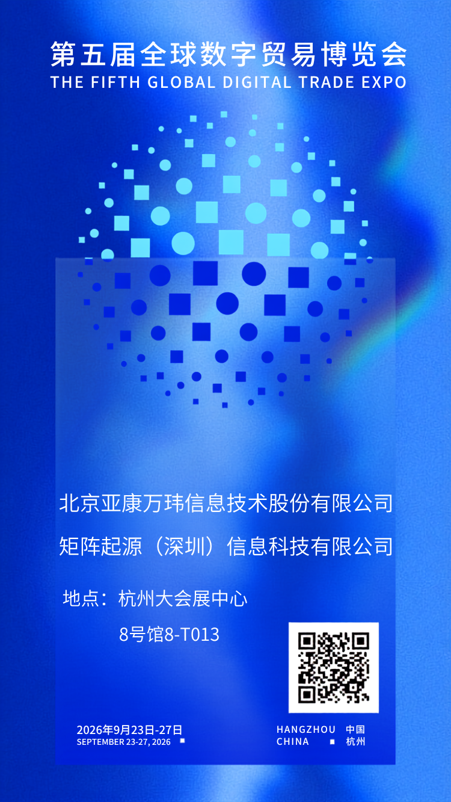

# 矩阵起源邀您参加第五届全球数贸会，共探AI与数字贸易新机遇

矩阵起源亮相第五届全球数字贸易博览会，本届数贸会以“在数贸会遇见 AI 未来”为年度主题，将于2026年9月23日至27日在杭州大会展中心举行，是国内唯一以数字贸易为主题的国家级、国际性、专业型展会。

## 展会看点 提前解锁

本次活动矩阵起源将与亚康股份、亚康启源，一起参展：

**亚康股份：算力全产业链综合服务商**

公司创立于 2007 年，2021 年 10 月于深圳证券交易所创业板（股票代码：SZ.301085）成功上市。作为算力基础设施综合服务领域领先的第三方服务商，公司致力于提供覆盖算力全生命周期的端到端服务：从算力设备的选型、采购与集成交付，到 AIDC 数据中心的部署与运维，再到算力集群的运营及 AI 推理能力的词元输出。

公司凭借长期的技术、实践积累，形成了为数据中心产业链上下游客户同时服务的能力和完善的服务体系。公司业务遍及全球，在北美、欧洲及东南亚等地区。公司目前拥有近1000家客户，在政府、金融、教育、制造、医疗、能源、集成电路、交通、互联网等领域具备广泛的客户基础，并与客户建立了深入和长期的合作关系。亚康秉持为客户服务的经营理念，利用国内外服务网络，从底层基建到上层应用，覆盖客户全周期需求。

**亚康启源：**

公司是由亚康股份与矩阵起源强强联合打造的全球AI算力运营与Token服务平台，以“AI基础设施+Token服务+Agent平台”的全栈能力，连接算力、模型、数据与Agent，让AI能力更易获得，让AI的企业级价值持续释放。

亚康启源打通“基础设施→模型服务→高价值Token→AI Agent与应用”的端到端链路，形成技术壁垒与生态护城河。亚康启源为全球客户提供算力运营、AIDC 共建、MaaS/TaaS 平台服务及联合运营，推动 AI 基础设施从一次性建设向长期 AI 服务运营演进，致力于成为全球领先的 AI 基础设施与 Agent 平台运营商。

**矩阵起源：企业级 AI 基础设施**

矩阵起源核心产品MatrixOne Intelligence（MOI）面向企业级智能体的开发、运行与持续进化，构建了覆盖数据、运行、记忆、进化和模型服务的一体化平台，帮助企业连接数据、知识、模型与工具，为智能体进入实际业务提供完整支撑。

AI原生数据底座：基于自研云原生超融合数据库MatrixOne统一管理结构化、非结构化与多模态数据，支持向量检索、全文检索、版本管理和数据追溯，为智能体提供持续更新的数据基础。

智能体运行与协作：通过智能体运行中枢Astra承载智能体运行，支持任务调度、工具调用、权限管理、工作流编排及多智能体协作，帮助智能体完成复杂业务任务。

长期记忆与持续进化：通过Memoria管理智能体的长期记忆、知识与上下文，并由Morpheus利用运行过程中沉淀的轨迹数据开展评测、训练与强化学习，推动智能体能力持续提升。

统一模型服务：通过Genesis连接模型与算力资源，提供模型路由、提示词缓存、调用成本分析和统一接入等能力，提升模型服务效率，优化Token使用成本。

相关能力已在多个行业场景中得到应用。欢迎来到现场，了解从算力基础设施、Token服务到企业级智能体应用的整体路径，共同探讨AI在实际业务中的更多可能。

## 期待与您现场交流

9月23日至27日，欢迎来到杭州大会展中心8号馆8-T013展位，与我们交流业务需求与应用设想，共同探索更多合作可能。扫描下方海报二维码即可报名参加。

期待与您相见，共探AI与数字贸易新机遇。

