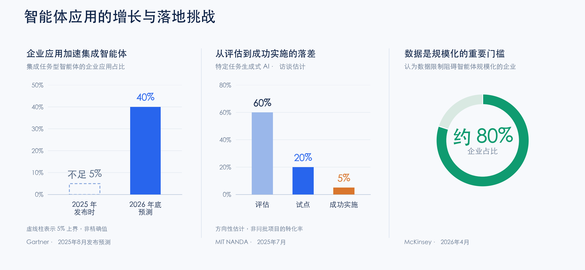
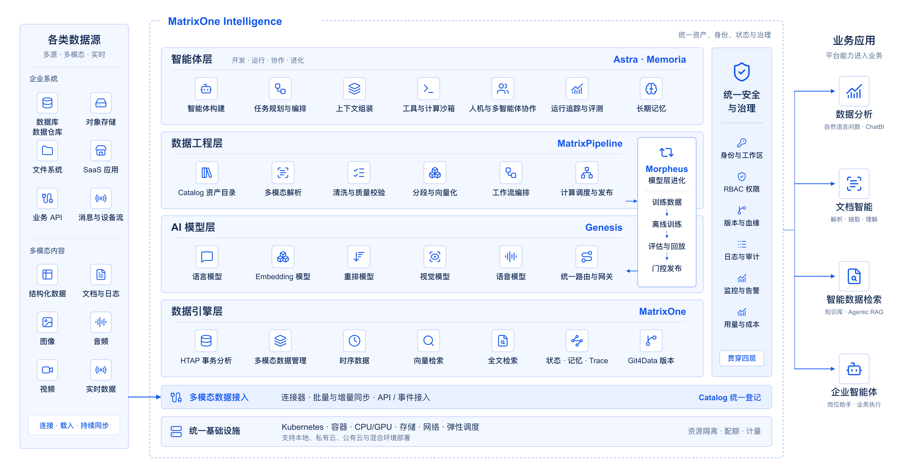
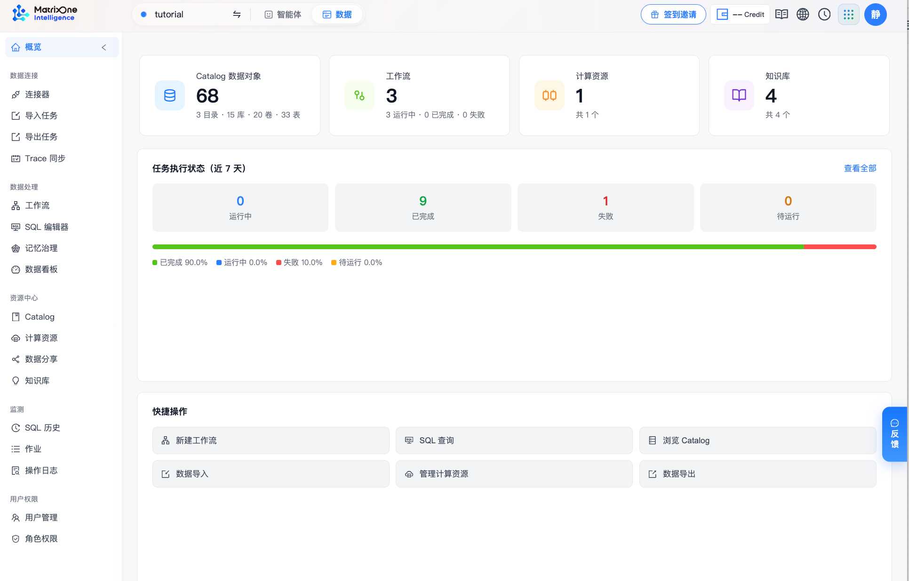
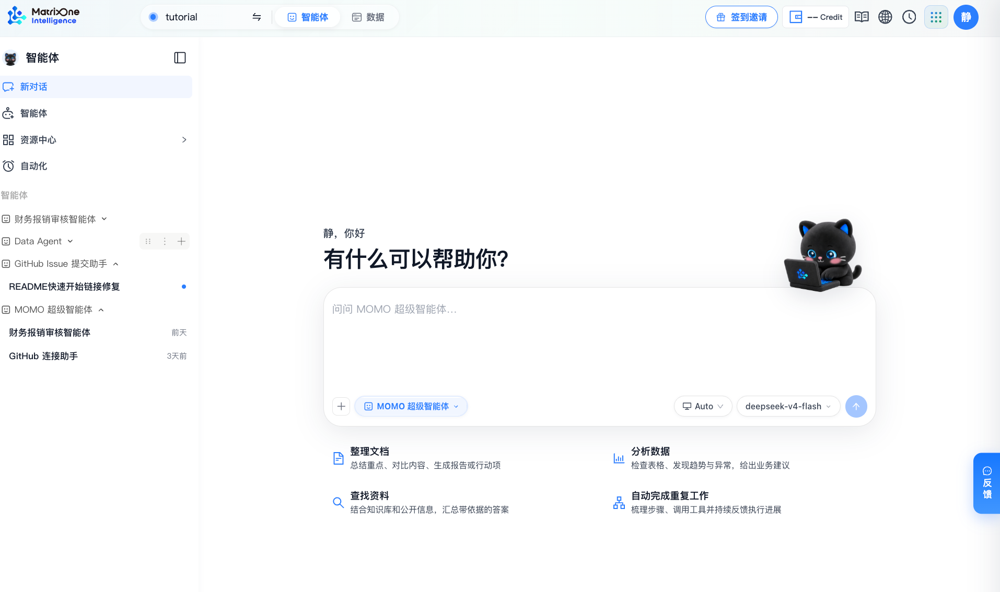
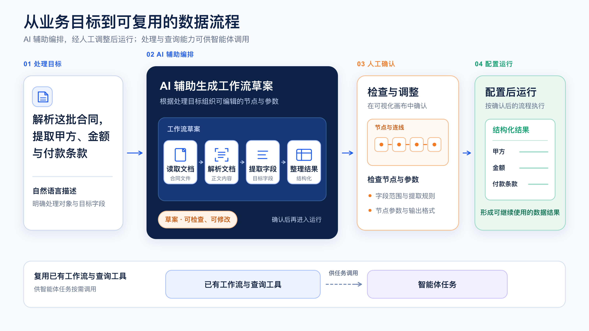
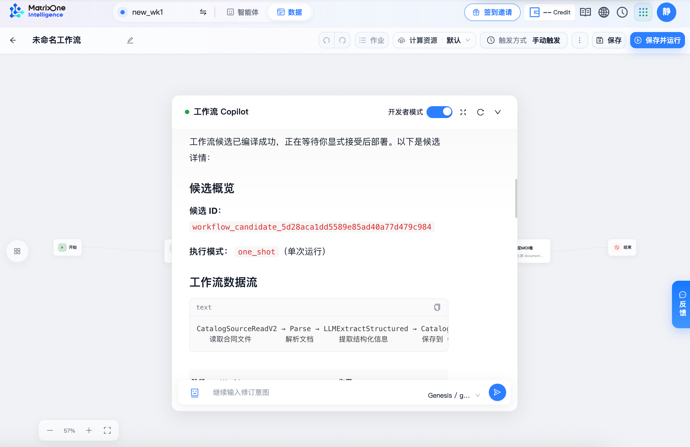
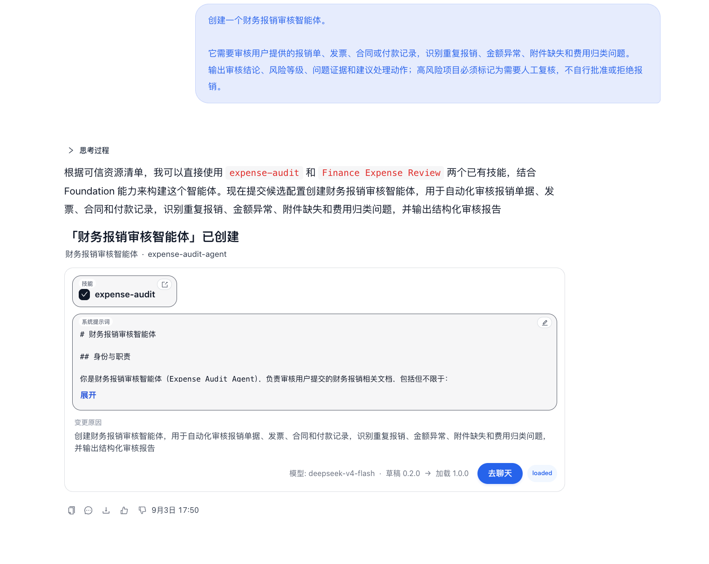

# 从企业数据到智能体生产力：MOI 5.0 正式开启首批公测

我们很高兴地宣布，MatrixOne Intelligence（以下简称 MOI）5.0 今日正式开启**首批公测**，仅面向 Waitlist 名单用户及受邀用户。从企业数据准备、模型调用到智能体构建，我们邀请您带着真实的业务需求，体验 MOI 5.0 的全新能力。

如果您暂不在本次公测名单内，欢迎加入我们的 **Waitlist 名单**。完成登记后，下一轮公测开放时，您会第一时间收到邀请，提前锁定体验资格。

受邀客户完成注册并激活账户，即可获得价值相当于 100 元人民币的 1,000 Credit 体验额度。公测期间，我们尤其期待听到您的使用感受：哪些能力帮您解决了问题，哪些环节还不够顺畅，还有哪些需求尚未满足。您的反馈，将帮助我们发现问题、明确改进方向，共同把 MOI 打磨得更好。

## MOI 是什么

### 企业级 Agent 落地的困境

过去几年，我们可以清晰地看到，AI 正在从回答问题的聊天机器人走向完成任务的智能体。而智能体已经逐渐开始在各种应用里展示惊人的效率和能力水平，这里尤其以 Coding Agent 为甚。可是当智能体真正在企业场景中开始应用的时候，则往往会出现无法从 Demo 走向生产的困局。[MIT NANDA 的调研](https://readwise-assets.s3.amazonaws.com/media/wisereads/articles/the-genai-divide-state-of-ai-i/v0.1_State_of_AI_in_Business_2025_Report.pdf#page=6)显示，在特定任务的生成式 AI 上，约 60% 的企业做过评估，20% 进入试点，最终成功实施的只有 5%。

模型能力之外，企业的数据是否可用，是其中一个关键问题。[麦肯锡在 2026 年的一篇研究文章中指出](https://www.mckinsey.com.br/our-insights/building-the-foundations-for-agentic-ai-at-scale)，约八成企业将数据限制视为智能体 AI 规模化应用的障碍。这些限制，往往体现在具体的业务细节里：智能体回答得头头是道，却引用了一份已经作废的报价单；老板问“上个月华东区的回款率”，财务和销售使用的指标口径并不一致；制度文档每季度都在修订，知识库却还停在半年前。

而每增加一个应用场景，数据接入、知识加工和权限配置，又可能需要重新做一遍。已经整理好的数据和已经跑通的处理流程，难以直接用于后续场景，重复建设与维护的负担随之增加。

让智能体用上准确、及时、口径清晰的企业数据，并让已经完成的数据准备和能力配置可以持续复用，是企业落地 AI 需要解决的基础问题。

### MOI：连接企业数据、模型与智能体

MatrixOne Intelligence（简称 MOI）是面向企业 AI 应用的数据与智能基础设施平台，提供数据接入与处理、模型调用和智能体构建能力。

您可以从自己的需求出发，使用其中的能力：

- **整理数据、构建知识库。** 接入文档、图片、音视频和业务表，完成解析、提取与加工，将分散的资料组织成可查询、可维护的数据与知识。

- **通过 Genesis 调用模型。** 使用 Genesis 提供的模型 Token 服务，通过统一接口接入大模型，并集中管理调用密钥、用量与费用。

- **结合知识和工具构建智能体。** 为智能体配置企业知识库、工具与技能，用于业务查询、数据分析和自动化任务处理。

这些能力也可以形成一整套数据和智能体体系：数据处理中形成的知识库，可以供智能体查询；已经配置好的算子和工作流，可以作为工具与技能继续用于任务。企业积累的数据、知识和处理方法，由此能够在不同应用场景中复用。

2026 年，矩阵起源也凭借 MOI 产品入选 Gartner®《[Coolest Vendor Innovations in Data Management](https://www.gartner.com/en/documents/8196329)》报告，成为报告收录的四家公司中唯一一家来自中国的企业。

此次公测，我们邀请更多企业与开发者亲自体验这些能力，在真实业务场景中检验它们的价值，并通过反馈帮助我们持续改进。

## 如何体验 MOI 产品

在矩阵起源的官网上**[点击注册 MOI](https://moi.matrixorigin.cn/)**，完成注册并激活账户，即可获得 **1,000 Credit 体验额度**。

MatrixOne、Genesis 与 AI Studio 共用一套账户。登录后，您可以根据需求选择相应产品，开始体验：

- **MatrixOne 云数据库服务**：MOI 持续提供的 MatrixOne 超融合数据库服务，适用于开发 AI 应用和传统数据应用，提供业务数据的存储、管理、查询与分析能力。可以从导入一份业务数据、执行一次查询开始。

- **Genesis 模型 Token 服务**：此次 5.0 新增的模型服务，通过统一接口调用大模型，并集中管理密钥、用量与费用。进入 [Genesis 控制台](https://taas.moi.matrixorigin.cn/)，选择模型、创建密钥，即可按接入指引尝试第一次模型调用。

- **AI Studio**：基于 MatrixOne 的数据能力和 Genesis 的模型能力，提供数据接入、处理、知识库与智能体构建功能。可以从上传一批文档、构建一个知识库开始，再为智能体配置知识、工具与技能，尝试业务查询、数据分析或流程处理；也可以通过自然语言生成数据工作流和智能体配置，在使用中继续调整。

首次使用，可以跟随[《MOI 5.0 官方上手教程》](https://docs.matrixorigin.cn/moi/zh/5.0/tutorials/overview.html)，逐步完成从数据接入到智能体搭建的体验。

## 公测体验福利

为了帮助大家充分体验 MOI，我们准备了注册、反馈、任务与邀请奖励：

| 参与方式 | 奖励规则 |
|---|---|
| 注册激活 | 首次注册并激活账户，即得 **1,000 Credit**，价值相当于人民币 100 元 |
| 提交有效反馈 | 通过页面右侧「反馈」入口提交问题，经判定有效后，获得 **200 Credit** |
| 平台任务 | 完成平台指定任务，累计可获得 **1,500 Credit** |
| 邀请好友 | 好友通过您的邀请链接注册并激活后，您与好友各得 **500 Credit**，最多邀请 3 人 |

平台各计费项以 Credit 计价，具体价格可在计费中心「产品定价」查看。

### 比体验更进一步，把您的反馈告诉我们

我们非常希望了解：产品能否解决您的问题，还有哪些地方需要打磨。

无论是数据接入失败、解析结果不准确、模型调用不顺畅，还是智能体没有完成预期任务，都欢迎通过页面右侧的 **「反馈」** 入口告诉我们。操作上的困惑、功能上的建议，以及尚未被满足的业务需求，同样值得留下。

提交反馈时，尽量说明**您想完成什么任务、进行了哪些操作，以及预期结果和实际结果的差异**；如有相关截图，也可以一并提供。这些信息能帮助我们更快定位问题，让改进更贴近您的实际需求。

**每一条有效反馈，都是对 MOI 的一次帮助。200 Credit 是我们的感谢，也希望支持您继续探索和验证。**

---

**[立即注册，领取体验额度](https://moi.matrixorigin.cn/)** ｜ [查看官方上手教程](https://docs.matrixorigin.cn/moi/zh/5.0/tutorials/overview.html)
