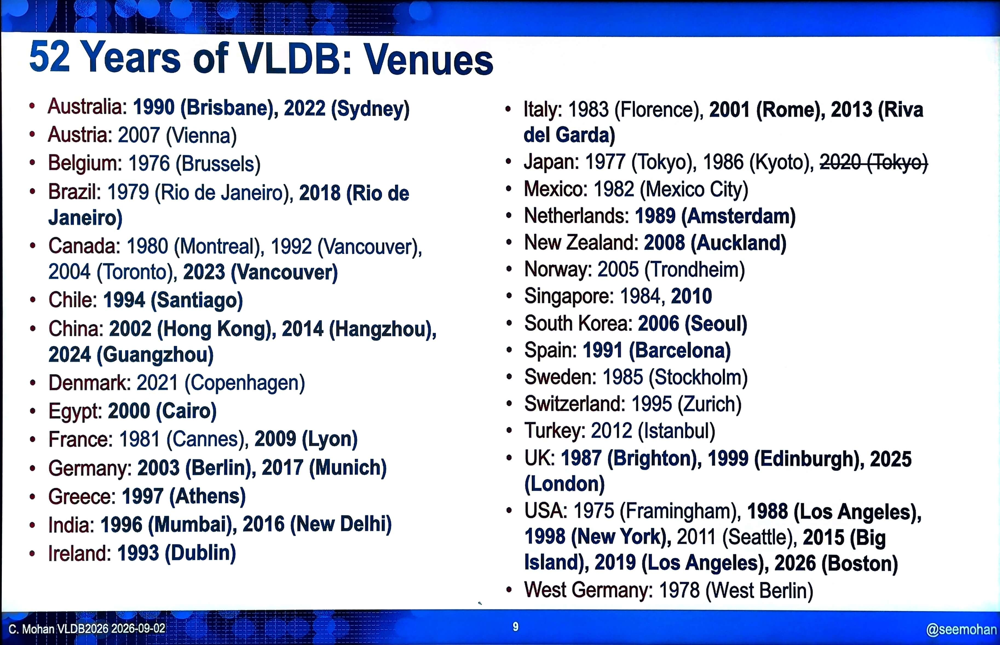
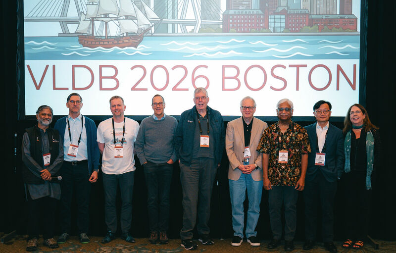
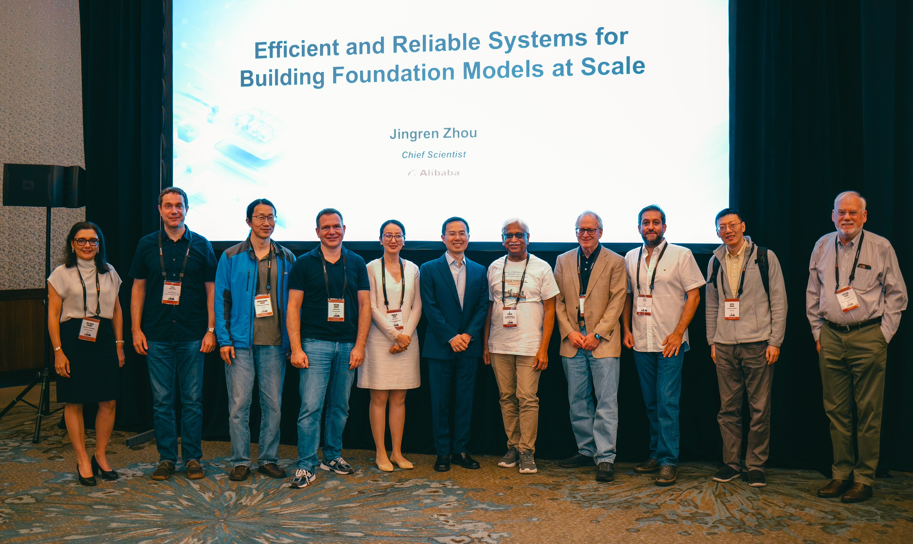
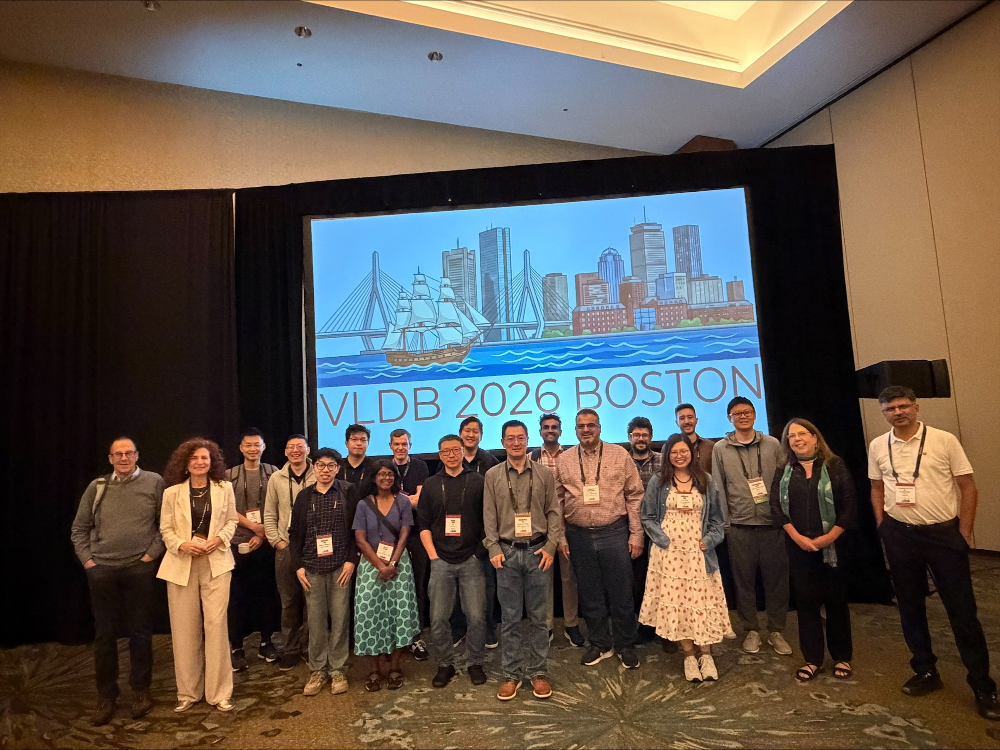
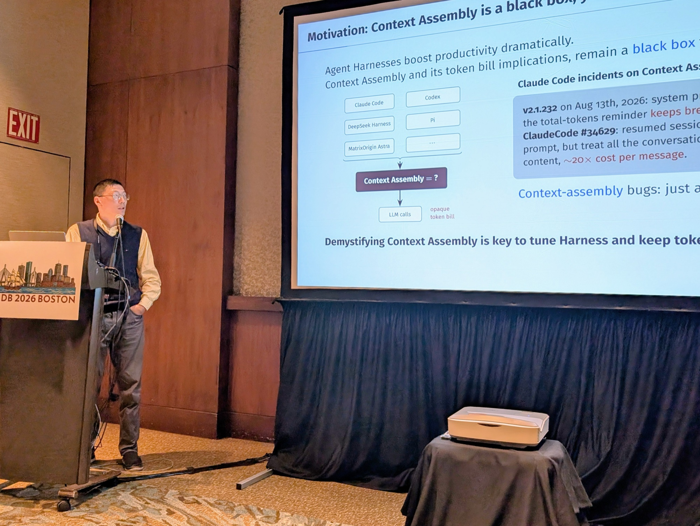
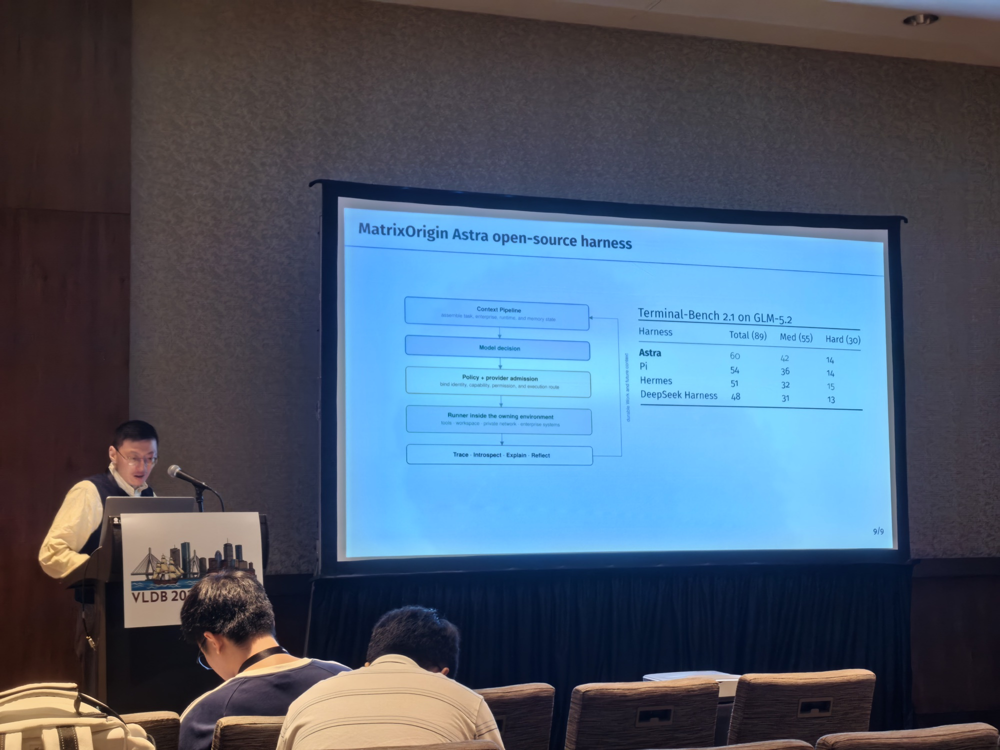
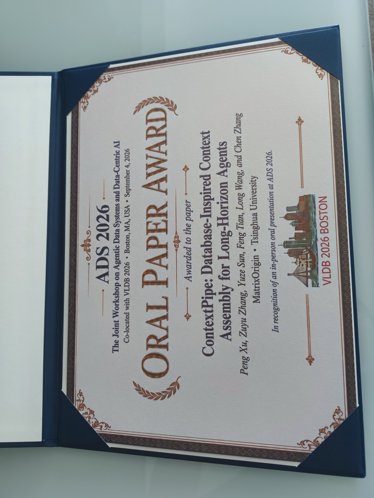

# 回到波士顿：VLDB 2026 见闻，半个世纪的数据技术变迁与新的黄金时代

*张祖羽博士的现场见闻 | MatrixOrigin*

*作者简介：张祖羽于 2019 年在威斯康星大学麦迪逊分校（UW–Madison）获得博士学位，研究方向为数据库系统。UW–Madison 数据库组汇聚并培养了许多学者和产业界领军人物，David DeWitt、Raghu Ramakrishnan 等数据库领域的重要学者也曾在此任教。这群活跃于 SIGMOD、VLDB 等国际学术社区的教授与校友，常被戏称为 “Wisconsin DB Mafia”。*

---

## VLDB 是个什么会？

VLDB，全称 **International Conference on Very Large Data Bases**，即国际超大规模数据库会议，创办于 1975 年，与 SIGMOD 并称数据库领域的两大顶级会议。今年是第 52 届。首届会议就在波士顿地区举办，此后逐渐形成在亚洲、欧洲和美洲轮流举办的传统。

时隔 51 年，VLDB 再次回到波士顿。会议特意安排了一场怀旧活动，邀请多位数据库领域的前辈，共同回顾从 1975 年至今的数据技术变迁。台上有大家熟悉的、已年过八旬的图灵奖得主 Michael Stonebraker，也有我们公司 CTO 田丰博士的导师 David DeWitt。

这个会议的名字，本身就浓缩了数据技术发展的历史。**Very Large Data Bases，超大规模数据库。** 在我看来，这几个词在 1975 年被写进会议名称时，就像一句宣言：**我们要处理的数据，已经超出了当时系统能够从容应对的规模。**

这句话放到今天依然适用：数据不断增长，系统的能力也必须不断向前。这个名字沿用至今，里面的每个词却都在被一代代技术重新定义：

- **Very Large**：从早年的 MB 级到今天的 EB 级，“超大规模”的参照系一直在变。
- **Data**：从结构化记录，到日志、向量、图和非结构化文本，再到今天围绕大模型产生和流转的数据。
- **Bases**：从单机存储，到分布式集群、云上的 Lakehouse，再到面向 Agent 的数据基础设施，组织和管理数据的方式不断演进。

一个会议能走过半个世纪，始终保持凝聚力，靠的正是这一点：**它始终围绕数据管理的问题展开，而技术和方法可以不断更新。**

**今年的 VLDB，让我感到这些老问题正在被重新提出。** 会上反复出现的一个判断是：我们正处在数据管理的第三个黄金时代。而这个新时代的关键词，是 **Agentic**。

Agent 正在改变我们看待已有系统、设计当下架构和思考未来需求的方式：

- **面向过去**：企业多年积累的数据和存量数据库系统，如何让 Agent 用起来？
- **面向现在**：新的数据基础设施，如何适应 Agent 访问和使用数据的方式？
- **面向未来**：随着 Agent 应用快速发展，哪些数据管理问题需要提前布局？

---

## 两场 Keynote：数据管理的新黄金时代

今年两场由华人主讲的 keynote，从两个方向回应了同一个问题：当 AI 开始大规模使用数据，而模型训练又依赖海量数据时，数据系统该如何承接这些需求？

### Reynold Xin：数据库工程的第三个黄金时代

第一场 keynote 来自 Databricks 创始人、首席架构师 **Reynold Xin**。他的演讲题目是：

> **The Three Golden Ages of Database Engineering: From SIGMOD '85 to the Agentic Era**

他将数据库工程的发展划分为三个黄金时代：

- **第一个黄金时代：关系模型与早期关系系统。** 核心问题是如何正确、高效地执行声明式查询。查询优化器、事务、代价模型，许多延续至今的基础都在这一时期奠定。
- **第二个黄金时代：大数据。** 分布式处理、列式存储、云上的存算分离，逐渐汇聚到 Lakehouse 等架构中。这一代系统重点回答的是规模问题。
- **第三个黄金时代：Agentic Era。** 新的负载正在涌入，包括 operational analytics、向量检索，以及大量由模型发起的请求。他也由此介绍了 Databricks 的 Lakebase 和 LTAP。

一个领域走过五十多年，许多基础问题确实似曾相识。但使用系统的主体、运行的任务和资源约束都在变化，旧问题因此有了新的难度，也重新打开了系统设计的空间。

### 周靖人：大模型背后的系统工程

第二场 keynote 来自阿里巴巴的**周靖人博士**。他从大模型训练与部署的角度，讨论数据与系统工程，题目是：

> **Efficient and Reliable Systems for Building Foundation Models at Scale**

这一场信息密度很高，也是我这几天做笔记最多的一场。

演讲从 Qwen 和 Wan 两条模型线的研发实践出发，讨论万亿参数规模的模型在训练和部署中面临的系统问题：分布式计算如何划分，大规模集群如何实现**容错**，以及如何在云上平衡**吞吐、延迟、成本和可用性**。当集群达到一定规模，故障就成了系统必须随时应对的日常。

听完这场演讲，我更强烈地感到：前沿大模型的预训练，越来越依赖电力、集群、故障恢复和调度效率，参与门槛也越来越高。对学术界、创业公司，以及像我们这样的小团队而言，我从中得到的最大启发是：

**大规模预训练的门槛越来越高，但后训练（post-training）和推理（inference）仍然有广阔的创新空间。**

具体来说，我看到了四点机会：

1. **后训练需要领域知识与系统能力的结合。** 除了算力，高质量、有结构、可追溯的数据流水线同样关键。这恰好是数据管理领域长期积累的能力。
2. **推理中有大量值得深挖的系统问题。** KV cache 如何管理和复用，如何在多租户之间调度，prompt 的哪些部分可以缓存、哪些必须重算，都能从数据库的缓冲池、物化视图和查询结果缓存中找到可借鉴的思路。做过存储引擎的人，对这些问题并不陌生。
3. **小团队可以在“更准”和“更省”上找到机会。** 无力投入十倍的 GPU，并不妨碍我们通过更好的系统设计，降低完成同一任务所需的 token 和计算成本。
4. **长期投入仍然有价值。** 大公司资源雄厚，却也承受着快速迭代的压力，各组件容易陷入局部优化，甚至重复建设。学术界和小团队如果能选准问题、持续投入，依然有机会做出更系统的方案。

---

## 会议上的其他见闻

这一周下来，能明显感到：性能优化、运维、优化器算法等传统数据库课题仍在推进，而 AI 和 Agent 正在吸引越来越多的关注与研究资源。

从 workshop 的安排就能看出这种变化。周一有 ADMS、AIDB、QDB、TPCTC 等熟悉的名字，其中一些已举办十几届。到了周五，主题明显转向新的方向：由清华大学李国良教授主导、我们参与报告的 **ADS**（Agentic Data Systems 与 Data-Centric AI 联合研讨会），以及 **VecDB**（第 2 届向量数据库研讨会）、**Agents + Graphs**、讨论人机协作 Agent 系统的 **DASHSys**、关注可组合数据管理的 **CDMS**，还有量子计算与数据管理方向的 **QCDKM**。

### Data Agents：写出 SQL 只是开始

主会场一场备受关注的 panel 是 **“Data Agents: Rethinking Data Systems in the AI Agent Era”**，由清华大学李国良教授和香港科技大学（广州）罗宇宇教授组织。讨论的核心是：企业几十年积累的数据，怎样才能真正被 Agent 用起来？

我听下来的感受是：**NL2SQL 是最显眼的问题，但更难的是确认 SQL 回答了我们真正想问的问题。** 模型写出一条能够执行的 SQL，已经不稀奇；要正确回答业务问题，Agent 还得知道企业有哪些数据、每个字段意味着什么，以及当前权限允许访问哪些内容。数据目录、元数据、语义层、数据质量，这些数据库社区做了几十年、往往不够引人注目的基础工作，如今直接影响着 Agent 能否落地。

另一场 panel **“Publish or Ship? The Research-to-Production Gap in Data Systems”**，则让我从工程落地的角度重新看待这件事：存量系统的改造，远不止论文中提出一个方案那么简单。进入 Agent 时代，如何跨过研究与生产之间的鸿沟，仍然是绕不开的问题。

### GPU Database：从 AI 计算走向通用数据处理

**另一件被频繁提起的事，是 GPU 正在进一步进入传统数据处理负载。** 今年最佳研究论文的 Honorable Mention 中，就有已经在业界落地的 GPU 数据库工作。

专注硬件加速的 ADMS workshop 已办到第 17 届。早些年，GPU join、GPU sort 等话题更多出现在学术讨论中；今年，主会场专门安排了 **“HW-SW Co-Design for Databases in the Age of AI-for-Systems”** panel，参与者来自 NVIDIA、Google、Microsoft、TUM 和 BU。

产业界的投入也越来越具体：cuDF 支持 GPU 上的 DataFrame 处理，cuVS 支持 GPU 上的向量检索；NVIDIA 与 Meta 合作推进 Velox 的 GPU 原生能力；IBM 将 Presto 扩展到多 GPU 集群，报告了最高 6 倍的性价比提升；Voltron Data 的 Theseus 则构建了分布式 GPU 查询引擎。

这里面也包括 **Sirius**，我们在 UW–Madison 的好朋友于向遥教授的项目。这是一个 GPU 原生 SQL 引擎，复用 DuckDB 的解析器和优化器，执行层基于 cuDF 在 GPU 上运行，并通过 Substrait 接入其他系统。在项目报告的 TPC-H 1 TB 测试中，它相较 CPU 版 DuckDB 实现了 9 倍的性价比，也刷新了 ClickBench 纪录。目前，SiriusDB 正与 NVIDIA 深度合作，推进整个查询引擎的 GPU 化。

今年 8 月，NVIDIA 将 RAPIDS 并入 CUDA-X 品牌。在我看来，这也传递了一个信号：**数据处理正在成为 GPU 平台越来越核心的能力。**

为什么是现在？我的理解是，一方面，企业希望提高已有 GPU 的利用率；另一方面，AI 流水线中的数据准备已成为不可忽视的瓶颈。当 Agent 将分析、向量检索和事务访问组合到同一条工作流中，统一利用硬件资源也就更有吸引力。对数据库研究者来说，数据搬运、内存层次、算子设计这些熟悉的问题，又一次摆到了面前，只是这次需要把 PCIe、NVLink 和 HBM 等硬件条件一起纳入考量。

### 我带回来的三个问题

整理这几天的笔记时，我发现自己带回来的问题比结论更多。其中三个问题尤其值得继续想下去。它们都与数据库人的积累密切相关，只是背景已经变了。

**第一，数据库如何更好地适应 Agentic 时代？执行轨迹（trace）和记忆，是否需要成为专门管理的存储对象？**

Agent 在使用数据的同时，也不断产生数据：对话历史、工具返回结果、中间执行轨迹。今天，这些内容往往只是作为日志留存，或者直接塞进向量库。但它们有生命周期、一致性要求和特定的访问模式，也会被反复读取。发起访问的逻辑又高度依赖模型和上下文，带来突发请求与长尾行为。面对这些特点，现有的缓存模型、准入控制和服务质量（QoS）机制需要怎样调整？数据版本又该如何管理？这些都值得认真设计。

**第二，Agent 时代的“正确性”，应该如何定义？**

数据库已经形成了可串行化、快照隔离等明确的事务语义。而在 Agent 系统中，我们还要追问：返回的上下文，是否足以支持模型完成任务、做出正确判断？这类正确性带有统计性质，又与下游任务紧密相关，如何形式化仍是一个开放问题。可串行化等概念也经历了逐步确立的过程，才为后来的系统提供了共同标尺。这一轮，我们同样需要可讨论、可验证的定义。

**第三，成本与可观测性，能否成为系统设计的核心目标？**

除了延迟和吞吐，我们现在还要关注 token 成本与缓存命中率。这些目标未必一致：为了减少上下文而进行的裁剪，可能需要额外调用几次模型，反而增加延迟。这是典型的多目标权衡，也是代价模型和优化器可以发挥作用的地方。

更麻烦的是，Agent 系统中的一些问题不会触发报错，只会悄悄体现在账单上。如果执行过程无法追踪和回放，就很难定位成本究竟花在了哪里。而当 Agent 大规模运行时，单位任务成本往往直接决定应用能否在商业上成立。

---

## 我们的工作：ContextPipe，用数据库的思路做 Agent 基础设施

9 月 4 日，会议最后一天，我们在 ADS workshop 上介绍了 ContextPipe。

我们做的事，一句话就能说清：**把 Agent 的上下文组装，当作一次数据库查询来优化和执行。**

Agent 每次调用模型之前，都要决定把什么放进 prompt、按什么顺序排列，以及何时压缩历史。这些决策既受上下文窗口的硬预算约束，也会影响对字节内容敏感的 prompt cache。如今，许多 Agent 执行框架（harness）把这些逻辑分散在 prompt builder、临时压缩程序和各家模型服务的适配层中，很难完整解释一次调用为什么消耗了那么多 token。

我们的观察是：**上下文组装与数据库查询处理，有许多可以相互借鉴的结构。** 两者都需要在资源约束下选择执行策略、利用分层缓存，并根据统计信息做决策。于是，我们引入了数据库中熟悉的做法：数据源目录（catalog）、确定性的缓存感知优化器，以及 EXPLAIN ANALYZE 式的执行追踪，让上下文组装过程可以审计、可以回放，也更容易定位故障。

ContextPipe 是我们的一次具体尝试：**用数据库领域积累的系统设计与工程能力，构建 AI Agent 的基础设施。**

在 SWE-bench Pro 子集的测试中，相比追加式上下文策略，**ContextPipe 将总 token 用量降低了 31%，LLM 调用次数降低了 23%，响应时间降低了 9%**，同时也带来了 KV cache 命中率的下降。这组结果体现了上下文规划中需要权衡的不同目标。

我们还将这套思路应用到了最近开源的 Astra 中。在 Terminal-Bench 2.1 上，使用相同的 GLM 5.2 模型，Astra 相比 Deepseek Harness、Pi 和 Hermes 等开源 harness 框架领先 5–10 个百分点，在 Medium 档上的领先尤其明显。对我们而言，这些结果表明：**当任务的上下文变长、变复杂时，显式规划能够带来实际收益。**

会议结束时，ContextPipe 获得了 **ADS 2026 Oral Paper Award**。这份来自数据库社区的认可，让我们更有信心继续探索这个方向。

从回顾半个世纪的技术变迁，到讨论 Agent 带来的新问题，再到分享我们自己的尝试，这次波士顿之行让我感受到：数据库领域积累的方法，仍然能为新的系统问题提供有力的支撑。所谓新的黄金时代，也许就始于这些熟悉的方法与新问题相遇的地方。
