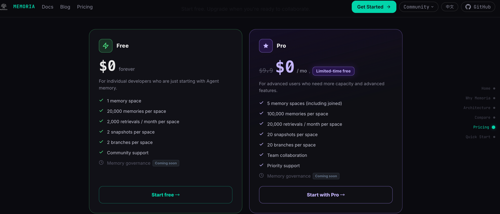
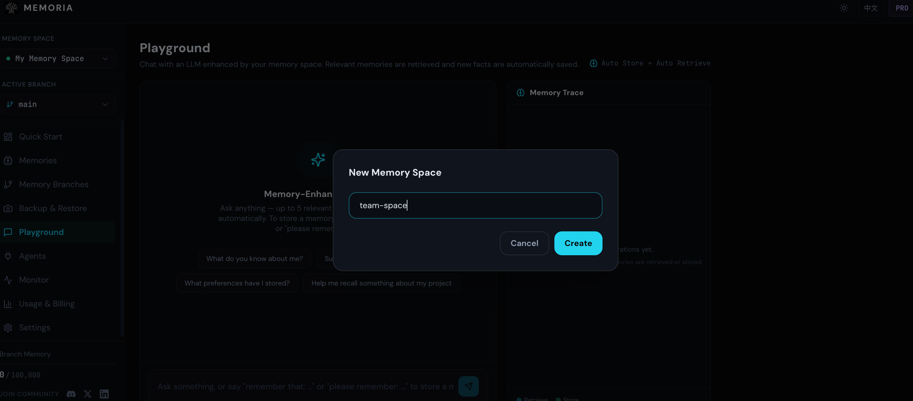
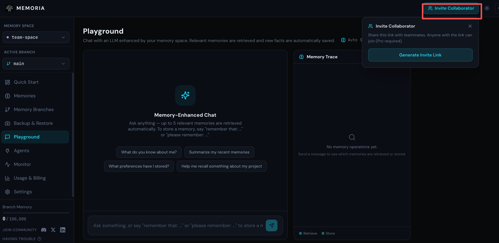
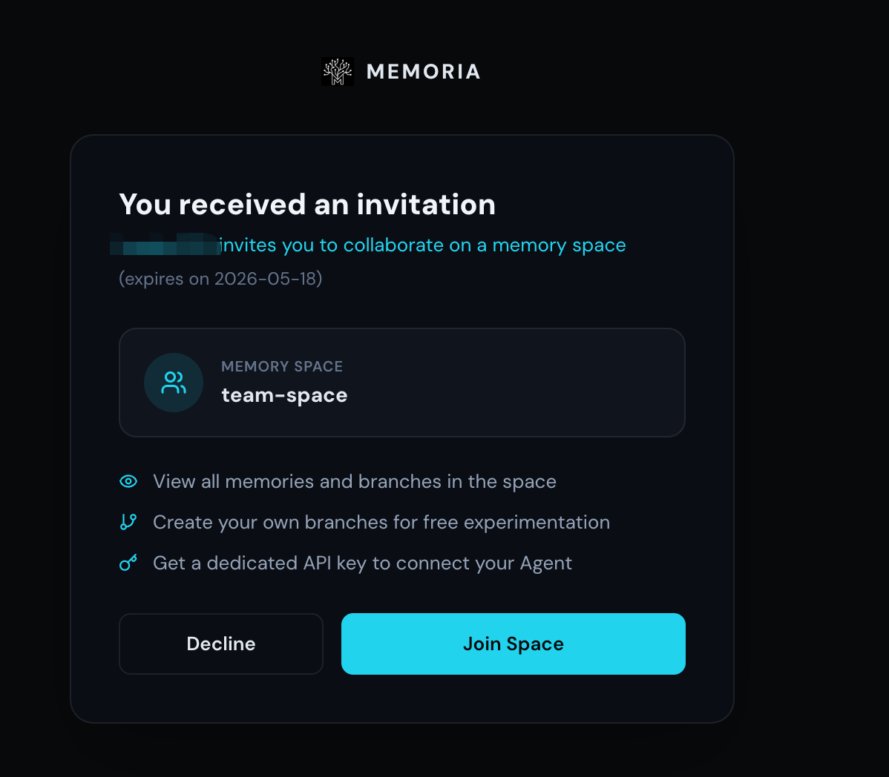
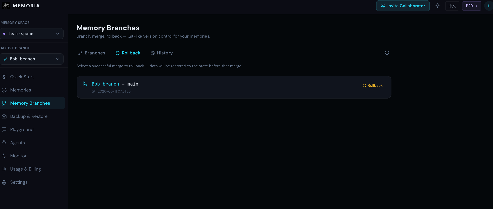

# Memoria Memory Branches and Collaborative Spaces Are Live: Bring Code-Style Collaboration to Agent Memory

Memoria memory branches and collaborative spaces are now live.

From now on, teams can collaborate on agent memory the same way they collaborate on code: each member works in their own branch, captures useful context, and merges validated knowledge back into the shared main branch.

Collaborative spaces are part of the Memoria Pro plan, which is currently available for free for a limited time. Compared with the Free plan, Pro provides more memory capacity, branches, snapshots, memory spaces, and retrievals, making it better suited for teams that need to continuously build and share agent memory.

---

Software teams spent decades learning how to collaborate on code well.

Early collaboration was simple, but fragile: shared folders, code sent over email, or someone saying, "Don't touch this file yet, I'm editing it." Eventually we got version control, branches, and pull requests. Not because engineers wanted more ceremony, but because when multiple people maintain the same thing, they need a mechanism for managing changes, evaluating value, and deciding what should be merged.

Now, more teams are bringing agents into their daily workflows. Behind every agent is a growing layer of memory: project conventions, historical decisions, hard-earned lessons, and reasons why a certain module should not be changed in a certain way. This is not a one-time configuration. It is the long-term accumulation of team knowledge.

But until now, the way we managed agent memory still looked a lot like the early days of shared folders.

---

## Memory Silos Keep Knowledge From Moving

An engineer who has worked on a project for a year often has extremely valuable context in their agent. Not just API details that could be written in documentation, but finer-grained judgment: why a previous approach failed, what historical baggage a module carries, or what a requirement was really trying to solve.

Much of this is not formal documentation. It is working memory formed over time between the engineer and their agent. The problem is that it often exists in only one person's space.

When a new teammate joins, that experience is invisible to them. Their agent starts from zero, repeats the same mistakes, and rebuilds the same context. When someone leaves, they take more than personal experience with them. They also take the project context that never made it into shared team memory.

That is the problem with memory silos. Everyone is accumulating knowledge, but that knowledge does not flow. Each agent becomes smarter, but the team's shared memory does not become more complete.

---

## Consensus Has to Be Maintained

Sharing memory is the first step. But sharing is not the same as collaboration.

If everyone directly edits the same memory state, new problems appear quickly. Which entries have been validated? Which are temporary ideas? Which are part of someone's experiment? When everything is mixed together, it becomes hard for the team to understand what this memory actually represents.

This is very similar to code collaboration. The main branch should not be a pile of everyone's ad hoc changes. It should represent the state the team currently trusts. Agent memory is no different. It needs to be shared, but it also needs to be maintained.

What matters is not merely whether a shared memory exists. What matters is whether that shared memory can be trusted by the team.

---

## Branches Protect Consensus

Memoria's branching model is designed for exactly this problem.

Each collaborator can create a working branch from the main branch. In that branch, they can add context, organize experience, or test a new way of structuring memory without affecting main or interrupting other collaborators.

When a piece of memory proves valuable, it can be submitted for merge with a clear reason. This step matters. It is not just moving content from one place to another. It is a judgment that this memory deserves to become part of the team's shared context.

In other words, not every memory should enter `main`. Only memory that has been validated, can be reused, and can be explained should become part of the team-maintained main branch.

As a result, the main branch is no longer an accumulation of every experiment. It becomes the consensus that remains after repeated team review. It continues to grow, but not as an unordered pile. It becomes more complete while remaining traceable, reversible, and understandable.

---

## How to Start Collaborating in a Space

In practice, the workflow has five basic steps: create a collaborative space, invite collaborators, create a branch from `main`, compare and merge, and roll back from history when needed.

Start by creating a collaborative space under your account.

Then switch into the collaborative space, copy the invitation link, and send it to the collaborators who should help maintain the agent memory. The `main` branch in this space represents the memory state everyone currently trusts.

After joining the space, a collaborator can create their own working branch from `main`. In that branch, they can add project background, organize experience, or test a new memory structure. These changes stay in their own branch and do not directly affect the main branch.

Once the memory is clear enough, they can click **Compare & Merge** to compare their branch with `main` and merge valuable content back into the main branch.

After the merge, that experience becomes part of the shared memory in the collaborative space, available for everyone to reuse.

Merges are not irreversible. If a merge later turns out to be unsuitable, you can use **History** to inspect previous memory states and identify the version you want to restore. When needed, **Rollback** brings the memory back to that more reliable version.

From creating a collaborative space to merging and rolling back, every operation revolves around the same `main` memory. Collaborators can safely organize and validate content in their own branches, and only the parts that prove valuable enter the jointly maintained main branch.

---

## Collaborative Spaces Make Team Memory Truly Shared

Branches answer the question of how consensus is maintained. Collaborative spaces answer the question of who can maintain it together.

In a collaborative space, all collaborators work around the same main-branch memory. One person may add deployment experience, another may organize module background, and someone else may merge lessons from a recent issue. The next person who encounters a similar problem does not need to ask again or wait for the right teammate to be online. Their agent can already retrieve context from the team's shared memory.

More importantly, this accumulation is continuous. Every valuable merge makes the team's memory more reliable. The more people collaborate, and the longer the project runs, the more significant the difference becomes between jointly maintained memory and isolated personal accumulation.

When something goes wrong, you can return to history and inspect memory states from different points in time. Find a more reliable version, roll back, and keep iterating. Team memory is no longer a black box that only moves forward. It becomes a collaborative asset that can be adjusted and restored.

Software teams spent decades learning how to collaborate on code. Agent memory does not need to repeat the shared-folder era.

With branches and collaborative spaces, teams can turn individual experience into a shared asset and make agent memory part of their long-term knowledge accumulation.